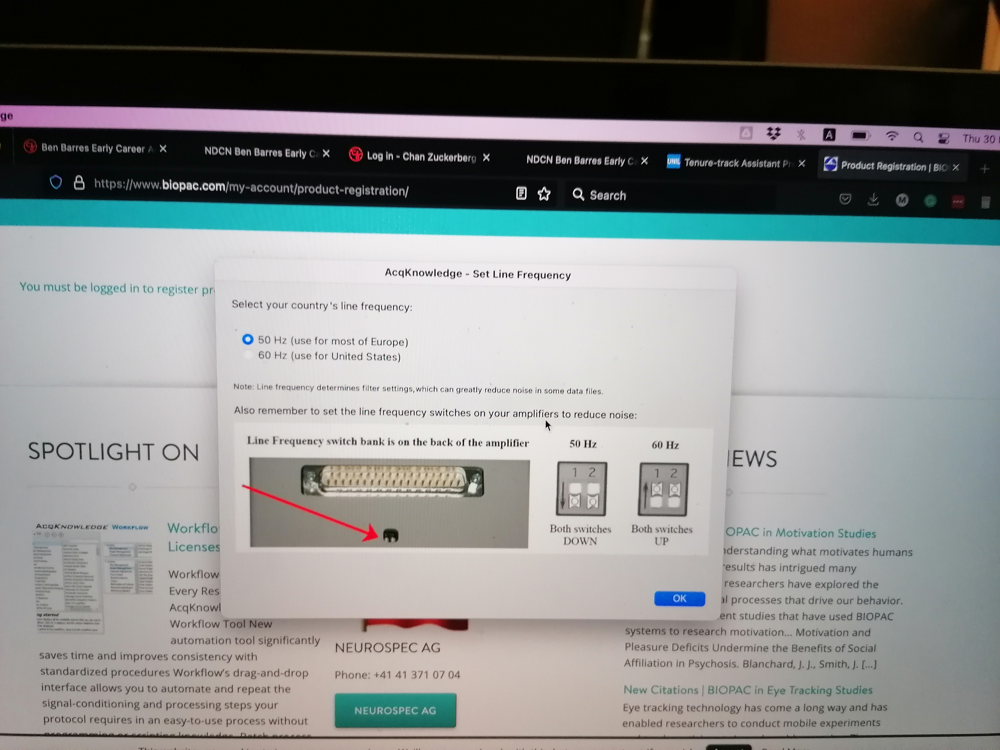
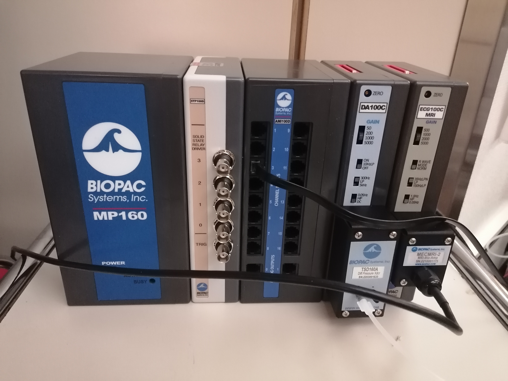

### Scheduling

#### One week BEFORE THE FIRST SESSION

- [x] Send a copy of the MRI Safety and screening form to the participant over email and confirm reception
- [x] Confirm that participant has read and understood the document, and in particular, double-check that they do not have any MRI contraindications
- [x] Remind participant that any jewelry should be removed prior to the scan 
- [x] Confirm clothing:
  - [ ] if allowed to wear street clothes, remind participant to avoid clothing with metal or that would uncomfortable to lie in for the duration of the scan; otherwise
  - [x] remark the participant they will be given a gown and they will need to change before every session.
- [x] If participant has indicated nervousness or history of claustrophobia, utilize mock scanner 
- [ ] Save the protocol by selecting all the sequences in the sequence list, click right to copy
- [ ] Go in the dot Cockpit, paste the sequences and save.

#### BEFORE DAY OF SCAN

- [ ] Make sure you have internet access, and update the fMRI-Control-Task repository. Assuming the repository is cloned from your <username>/fMRI-Control-Task and you have another remote `upstream` pulling from `git@github.com:theaxonlab/fMRI-Control-Task.git`:
    ```
    git fetch upstream
    git checkout main
    git rebase upstream/main
    ```
- [ ] On the hos68752 laptop, open a terminal and execute `conda deactivate`.
- [ ] Open psychopy 3 by typing `psychopy`
- [ ] Load in the different experiments and check for proper functioning if there were changes.

#### DAY OF SCAN, prior to participant arrival

- [ ] Remove the head coil that is currently installed. If it is the 64-channel, you can just temporarily move it into the scanner's bore. Otherwise, store it on the shelve where the other coils are and bring the 64-channel one in the proximity of the bed (e.g., inside the scanner's bore).
- [ ] With no head-coil installed, remove the spine coil by lifting the corresponding lock and replace it with the back paddings.
- [ ]	Take the 64-channel head and neck coil and fixate it onto the head end of the bed. This operation may require the removal of paddings and fittings of other coils, if they were present.
- [ ] For the eye-tracker, you should remove the ventilation and the light inside the scanner bore [TO DO : INSERT PICTURE]

**Setting up the Biopack and physiological recording tools**
- [ ] Set up the line frequency switches on the back of the Biopack amplifier depending on your country frequency to reduce noise. Both switches should be DOWN if your country's line frequency is 50Hz. Both switches should be UP if your country's line frequency line is 60Hz. [@oscar: should those info be in our SOPs or not?]

- [ ] Plug the different units of the Biopack together if it has not been done yet. We use the Biopack to synchronize and output in a single file all the physiological signals we record: cardiac pulsation, respiration and CO2 concentration.
  - [ ] The solid state relay driver unit is used to record triggers. A trigger appears as a vertical red line on your physiological recordings [INCLUDE IMAGE]. Plug the trigger to the TRIG entrance.
  - [ ] The AMI100C unit can receive up to 16 analogic signals. 
  - [ ] The DA100C unit records the signal coming from the respiration belt. Plug the TSD160A unit on the DA100C.
  - [ ] The ECG100C MRI unit records the electrical signal coming from the heart via the ECG. Plug the MECMRI-2 unit on the ECG100C unit.
  

- [ ] Plug in the power cord.
- [ ] Plug in the ethernet (the plug is in the back) to the ethernet port of [WHICH COMPUTER].

- [ ] Plug the USB key to the computer [WHICH COMPUTER]. The USB key not only contains the program for installation of the Biopack software, it also contains the license necessary to operate this software. It needs to stay plug at all times during the acquisition. [INSERT PHOTO]
- [ ] Install the gaz analyser on the wood platform behind the MRI consoles.
- [ ] Go inside the scanning room, unscrew the wood cap that covers the hole in front of the MR.
- [ ] Delicatly pass the nasal canula through the hole while avoiding that the canula touches the floor. Rest the canula on the bed ready for the participant to install and connect the other end to the corresponding plug in front of the gaz analyser. 

- [ ] Pass then the tube of the respiration belt through the same hole resting one end on the MR bed and connect the other end to the TSD160A biopack unit on the + plug.

- [ ] Connect the coaxial cable to the C02 output in the back of the gaz analyser and the ethernet end into one of the channel of the AMI100D biopack unit. [I'M NOT SURE ABOUT THAT CONNECTION]


- [ ] Plug in the power cord in the back of the gaz analyser and turn it on using the O/I switch. [ADD PHOTO WITH CONNECTED CABLE]


**Setting up the eye-tracker**

!!! info "Thanks"
    All the documentation about the eye-tracker is derived from Benedetta Franceschiello's user guide.

- [ ] The eye-tracker (ET) computer is kept on its designated rolling table, which is stored under the projector in room BH07/075. Behind the rolling table, there is a transparent panel where the ET camera will be set up inside the scanner bore.
- [ ] Verify that the monitor and the cable, as well as the ET over the PC tower are fixed to the rolling table with scotch tape.
- [ ]	Bring the table with the ET computer to the access closet (outside) of the scanner room. Be very attentive during the displacement and lift the front wheels when passing steps or cables. The transparent panel can also be brought to the scanning room simultaneously, if done with care.
- [ ]	From room BH07/071 (first cabinet on the left), take the box with the «fMRI usage» label, containing the ET camera, lenses, and the special infrared mirror. 
- [ ]	Take out of the lenses box the MR-Compatible lense. It is easy to recognize it, from its two golden screws.


- [ ]	Un-screw any present lenses, being very careful: one hand must be hold under the lens, to avoid crashes, as it is a bit tricky to screw and un-screw it. In case a lens it’s already present, un-screw it and put it back to its plastic bag, inside the lenses box. 


- [ ]	Be Careful: the lens needs to be substituted before entering inside the Scanner Room

** Now you can enter the scanner room**

- [ ] Place the transparent standing panel inside the scanner bore, following the indications stuck on the panel (i.e., it has indication of which side goes up and tape markers for the position of the ET). The plastic feet on the panel need to face the rails to prevent the plate from sliding. The tap markers need to be close to the exit of the MRI bore. DON’T PUSH IT inside, the plastic base should be aligned with the end of the rail. [TO DO : INSERT PHOTO]
- [ ]	Take the ET inside the scanner room, and put it on top of the plastic base. The two back "feet" of Base of the ET have to be within two corners made of transparent scotch and already attached to the plexiglass. **BE CAREFUL, HOLD IT STRONGLY, CAUSE THE MAGNETIC FIELD GENERATES RESISTANCES.** Connect the cables (two plugs for the black, one plug for the orange).
- [ ]	Open the door of the cable section between the recording room and the scanner room.
- [ ]	First pass the optic fiber (orange wire) and the power cable (the one with a fabric sheet) through the access point (TODO: ATTACH PICTURE). This operation requires two people, one handling the cables from outside the scanner, and the other gently pulling them from inside. Both people will lift the cable to avoid its abrasion with the edges of the metallic cylinder, which is the passage between exterior and interior of the scanner room. Once the sliding of the cable is finished, leave the extremities inside the scanner room in the left-top corner, far from the scanner. These parts are magnetic.
- [ ]	Detach the mirror frame from the head coil, if it is placed there. Remove unnecessary items from the scanning bed, and prepare the mirror to attach the infrared mirror of the ET at a later step.
- [ ] Prepare two long stripes of scotch tape and leave them in a convenient place to then attach the ET mirror with them on to the standard mirror. E.g., attach the corner of each strip to the back part of the mirror frame.
- [ ]	Take out the box containing the infrared mirror from the «fMRI usage» box. **<span style="color:red">DO NOT EXTRACT THE MIRROR OUT FROM ITS BOX YET</span>**. The mirror's box is labeled as [*RELIQUIA DI SAN GENNARO*](https://it.wikipedia.org/wiki/San_Gennaro#La_reliquia) to emphasize that **THIS IS THE MOST DELICATE PART, BECAUSE THE MIRROR CANNOT BE REPLACED <span style="color:red">NOR CLEANED</span>**. This mirror is **EXTREMELY EXPENSIVE**. 
 


- [ ]	Get two gloves (e.g., from the box hanging at the entrance of the scanner room), then approach the scanner bed. Put the gloves on, and **DON’T TOUCH ANYTHING**. You MUST have the standard mirror dismounted and in front of you at this point. **WITH THE GLOVES** proceed to extract the infra-red mirror from its box, being extremely careful. **YOU CAN ONLY TOUCH THE MIRROR WITH GLOVES**, because it cannot be cleaned up. Watch out for **FINGERPRINTS** and once taken out of its box, **IMMEDIATELY PROCEED TO ATTACH IT** to the standard coil mirror. The mirror MUST NOT be placed anywhere else if not in its box.
- [ ]	**WITH YOUR GLOVES ON**, attach the ET mirror to the standard coil mirror (the larger mirror that points toward projector's screen at the back of the scanning room). Put it more or less in the center, although <span style="color:red">this position may need to be adjusted</span> (being careful and with the same precautions explained before) and stick it with the paper scotch. **Do not touch the surface of the ET mirror.**
- [ ]	Place the mirror frame back on the head coil. As always, **DO NOT TOUCH THE MIRROR**. 

**Back OUTSIDE THE SCANNER ROOM**

- [ ]	Connect the Power cable to the metallic extremity belonging to the ET PC-tower


- [ ]	Plug in the Power strip containing the ET Power Cable, the PC-tower power, etc


- [ ]	Switch on the ET PC-tower, as well as the laptop. Select "Eyelink" when given the option of which operating system to launch.


- [ ]	This is the sync box of the scanner, allowing a synchronization of the triggers between the scanner sequence and the ET recordings.


- [ ]	Connect to the **hos68752** laptop the ET- ethernet blue cable and the USB sync box. If it’s plugged into the sync box, it needs to be re-plugged in after usage.


- [ ]	Connect the **hos68752** laptop to the screen switch box (see picture below) with the corresponding HDMI cable. This should project your screen on the second screen.


- [ ] In the Linux parameters go to Display in order to adjust the resolution of both primary and secondary screens to **800x600**.
!! It is crucial that the resolution of both screens, as well as the resolution in the Psychopy code is 800x600, for the eye-tracker calibration to work !! 

- [ ] Double check that the IP address corresponding to the ethernet interface of the **hos68752** laptop is correct. You can either run `ifconfig -a` or use the GUI. Make sure the IP/mask is **100.1.1.2/24**, and the protocol is IP version 4. Execute `ping 100.1.1.1` to see if the eye-tracker is responding with echoes.

- [ ]	Now it’s time to check that the sync box correctly [WRITE ON HOW TO SEND TEST TRIGGER MANUALLY]

- [ ]	Once the previous has been checked, it’s time to put the sync box in “Synchronization” mode. Start the session: the box it’s ready to receive the trigger from the sequence and they will be available for Experiment builder / Python / whatever is used to register the trigger and the ET signal.


- [ ]	Switch the projector on by hitting the power button on on its right side. The projector is found in room BH07/075. If the projection is not well located, the projector needs to be adjusted. E.g., change the height of the paper pile that supports it (see images, FENS papers).


*The hole is the part through which we should check the quality of the projection*


- [ ] Go back to the hos68752 laptop, open a terminal and execute `conda deactivate`.
- [ ] Open psychopy 3 by typing `psychopy`
- [ ] Open the <ENTER_TASK_NAME>
- [ ] Run the experiment by pressing the green play button. 
- [ ] Enter the session and participant number in the pop up window.
- [ ] The Eyelink system setup page opens
- [ ] Press enter to begin the camera setup mode. If the projector is correctly setup, you should see one of the view of the eye projected on the screen in the scanner room. On the Eyelink system, you can see two views: one is the field-of-view of the eye-tracker, the second is an automatic zoom on the eye itself (or a random part if the eye is not visible). To ease the setup of the eye-tracker, switch to the full view in the camera setup mode by pressing the left or right arrow.
- [ ] Verify that the calibration chosen is in the options [VERIFY EXACT BUTTON NAME] the 6-points one 
- [x] Check stimulus display and response device:
  - [x] Check the movie to be displayed is ready
  - [x] Check the execution of the Breath holding task
  - [x] Check the execution of the finger tapping task


**Set-up of documents and equipment**

- [x] Prepare consent documents (first session only)
- [x] Prepare an MRI safety screener 
- [x] Prepare scrubs and MR-compatible glasses if applicable
- [x] Setup scanner room and peripherals:
  - [x] prepare the 64-channel headcoil,
  - [x] prepare paddings: under-knee padding, neck padding, inflatable head-paddings
  - [x] prepare a blanket
  - [x] prepare a new pair of earplugs
  - [x] prepare the respiration belt, as well as the placeholder for the ECG and other physio sensors
  - [x] connect the cable from the RJ-45 output of the syncbox to the first filter (VNC connector; has a label "External signal") in the cupboard covering the access panel to the Faraday cage. The cable might be stored in the lower left cupboard of office 071. Make sure you will have access to the cable with sufficient time ahead.
    - [x] On the scanner console, check the external signal input registers triggers from the syncbox
    - [x] prepare a thermometer
    - [x] prepare a blood preasure meter
  - [x] Prepare the gas-analyzer:
    - [x] Prepare the canule tube, which is introduced through the tube in the access panel
    - [x] Prepare a new canule

#### DAY OF SCAN, right when the participant arrives

- [x] Have participant fill out consent documents and MRI safety screener, and verbally confirm responses, paying attention to frequently forgotten devices and implants, like orthodontia
- [x] Have participant empty their pockets or change into scrubs, and remove all jewelry/hair accessories and check for any missed metallic objects with the scan center’s preferred method
- [x] Instruct participant on staying still and encourage them to request breaks if necessary
- [x] Describe the participant how the session will develop, with special attention to tasks. Answer all the questions that may arise.
- [x] Show the alarm button to the participant, instruct them to hold it on their hand throughout the session, with the exception of the finger tapping task for which they should leave it on their belly
- [x] Place participant on the scanner's bed:
  - [x] Accommodate the head inside the head coil
  - [x] Check again that it is the 64-channel head coil
  - [x] Check the scanner's screen that the three coils [SAY MORE SPECIFIC] are connected and active
  - [x] Solicit feedback on participant’s comfort while positioning them on the scanner bed and suggest ergonomic positioning of arms to avoid discomfort
  - [x] Make sure the speaker is audible (and not annoying) and confirm the participant's feedback

#### DAY OF SCAN, participant setup

- [ ]	Take the half-circle one-direction screen from the table behind the scanner and put it on the back of the scanner, behind the ET system (don't push the plexiglas yet)
- [ ]	Memorize where the other tools for the recordings are, to put those back in place at the end (coil, emergency button, ears cover.) 
- [ ]	Bring the participant inside the room, and give him the ear-plugs to protect the hearing during acquisition.
- [ ]	Give to the participant the emergency button. Make the participant try it, so they can see it works. To switch off the alarm, there’s a button on the scanner (circular, both on the left and on the right of the hole) 
- [ ]	Adjust the participant inside. With the pillow, its head position needs to be adjusted and elevated until the head can’t move anymore and the nose and the front of the participants are both adherent to the upper coil. This procedure guarantees that the ET "sees" the eyes. If not, the experiment gets stuck.
- [ ]	This part needs to be repeated taking out and putting back the upper part of the head-coil, adjusting the pillow at every step, until the head is fixed and the nose and front of the participant touch the coil. In case of need, ask the participant to "say yes" with the head (chin on neck) and keep this position, place the pillows, place the coil and check that the participants' front touches the coil. Now the nose can also be a bit far from the coil. Tell the participant to relax the neck, so the nose should go a bit up and touch the coil. For our HCPH participant, we found that the adapted height of pillow is obtained by superposing the two pillows in the picture below .
    
    
- [ ] Install the respiration belt on the participant and connect it to the tube [INSERT PHOTO]. The respiration belt measure the displacement of the stomach induced by breathing, it thus needs to surround the stomach comfortably. [GIVE MORE PRECISE INFO WHERE SHOULD IT BE PLACED]
- [ ] Place the nasal cannula in the nose of the participant making sure the two protrusion are aligned with the nostrils of the participant. Place the tube behind the ears and tighten behind the head for comfort and stability by sliding the ring.
- [ ]	Take the Ears -protection pillow, stick it on top of the ears of the participant, one by one. Once they are settled, you can pump it, until the participant is comfortable, the head is fixed and the ears are protected.
- [ ]	Once the previous part is insured, the participant is ready. If he's cold, put a blanket on top of him. Give to the participant the emergency button. 
- [ ]	Gently move the participant with the manual regulation. Stop when the head is under the head-localizer. Ask the participant to close it's eyes, localize the head with the infrareds.
- [ ]	Switch off the infrareds, now the participant can open the eyes. You can move the participant (always gently as before) inside the scanner, until the mm counter marks “Isometric”.
- [ ]	Go behind the scanner, push the plastic base until it touches the bed. Hold on the Eye-Tracker.
- [ ]	Regulate the Eye-tracker position until you see from the projector screen the Eye. The optimal position for the eye tracker is to see the eye in the middle of the square delineated by the coil. If the eye is correctly tracked, two crosses should appear on it. The right lens needs to be manipulated rotating the roller, like what you would do with your reflex to obtain the focus. Alternatively, you can also try to click the button "Autofocus" on the console.
  - In case of need, you can adjust the strength of the infrared light (emitter). This is the black box on the other side with respect to the lens. Under the emitter there are two little screws. Unscrew, move the emitter front/back, check the contrast of the face image, re-screw. Once the eye is well seen, the image is zoomed (externally by the operator in front of the PC-tower) to the pupil. 
  - If the position of the Eye-tracker is not satisfying, you can move the base. 


- [ ]	If the pupil and the eye are correctly seen (indicated by the crosses following them), you can go out. The calibration needs to start. 
- [ ]	Tell the participant that he will need to follow some point with its eyes, without moving his head.
- [ ]	Tell the participant to move the eyes ONLY after the point moves (do not anticipate).
- [ ] Launch the calibration by pressing C on the laptop keyboard or by clicking on Calibration on the ET interface.
- [ ] When the gaze is stable and the validate button [VERIFY THE EXACT NAME] appears green, you can manually click on it to validate the first position.
- [ ] The following positions should be validated automatically when the gase is stable enough. If it is not the case, manually click on the validate button when it turns green
- [ ]	The ET software needs to show a cross performed during the calibration. If not, the ET inside the scanner needs to be adjusted.
- [ ]	If not, the head of the participant needs to be adjusted again.
- [ ]	If not, the mirror needs to be moved up or down (being careful as mentioned before). Just a few mm can ruin the calibration and the eye-position.
- [ ] When the calibration is successful, launch the validation by clicking on validation on the ET interface or clicking V on the keyboard of the laptop. Follow the same instructions as in the calibration to validate the positions.
- [ ]	<span style="color:red"> If the calibration is ok, you can move forward. </span>
- [ ] <span style="color:red"> Turn the pump of the gaz analyser on </span> and make sure the flow control is set on maximum.

#### SCAN TIME

- [ ] Start a new exam by clicking on examination
- [ ] Search the patient by clicking on the "Patient Browser" in the top left corner
- [ ] Search for "Oscar esteban"
- [ ] Right click and select "New examination"
- [ ] Enter the weight and height of patient
- [ ] Select the right protocol under "Oscar" 
- [ ] Select Brain as the organ
- [ ] Select the Position as "Head supline"
- [ ] For obtaining good SNR on the AAL sequence, plug the coil after the exam has been open
- [ ] !!! Adapt the reproin name of the sequence according to its "Phase Encoding Dir." field !!!
- [ ] Open the parameters of the sequence named "fmap-phasediff__gre" and ensure that under Contrast>resc. the option "Magnitude et phase" is selected. This is crucial so that both the magnitude and the phase difference field map images are saved.
- [ ] Start Exam
- [ ] Launch the AAhead_scout by pressing "Continue"
- [ ] Launch the T1w by pressing "Continue"
- [ ] Once the T1w is finished, you can drag the T1w into the scan viewing window by draging the three superposed squares next to the sequence name. This will allow to tweek the field-of-view (FOV) for the DWI and BOLD sequences
- [ ] Make sure that the FOV (yellow square) includes the whole brain. If the full brain, including the cerebellum, do not fit in the FOV, favorise making sure that the cortex is fully enclosed in the yellow square. Careful for reproduciblity do not tilt the FOV; just translate it.
- [ ] Once the FOV is well placed, launch the sequence by pressing "Go"
- [ ] If two sequences have the same resolution and the same number of slices, you can copy paste the FOV by clicking right clicking on the sequence for which the FOV was set, select "copy parameters>[WHAT WAS THE NAME]"
- [ ] You can set the worker icon on the left of the sequence if you want to pause before starting that sequence. If the worker is not present, the sequence will launch automatically.

- [ ] !!! Adapt the reproin name of the sequence according to its "Phase Encoding Dir." field !!!

**Scan console checklist**

Parameters to double check

  - [x] MUX: 3
  - [x] TR: 1490
  - [x] TE: 3

Console instructions 

  - [x] 1. Run localizer
      - [x] SAVE Rx
      - [x] SCAN

  - [x] 2. Prescribe rest  
      - [x] Select `task-rest_bold` and click once on the localizer image that appears.
      - [x] Move the block of lines so that the whole brain is covered, with plenty of space in the front and back, top and bottom.
      - [x] **Do not run yet!**

  - [x] 3. Run shimming
      - [x] Select **GE HOS FOV28**
      - [x] SAVE Rx
      - [x] SCAN
      - [x] Adjust circle around the brain so that the red circle goes as tightly around the brain as possible
      - [x] CALCULATE
      - [x] **Done**
      - [x] Select the same scan again
      - [x] SCAN
      - [x] Add to Same Series
      - [x] CALCULATE
          - [x] If the difference between expected and actual is  < 1 continue; else repeat. 

  - [x] 4. Fieldmap
      - [x] Select fmap-fieldmap 
      - [x] Click the brain once, adjust the prescription so that it covers the whole brain. 
      - [x] SCAN 

  - [x] 5. Rest Scan 
      - [x] Select `task-rest_bold`
      - [x] Already prescribed from shim setup.  
      - [x] Put the fixation cross on the bore monitor, check in with the participant:

           > Hey [NAME], we are about to start our first scan run.
           > For this scan, all you have to do is stay still, and look at the screen.
           > Let us know when you’re ready to begin by pressing any button.

      - [x] PREP SCAN
      - [x] Physio setup 
          - [x] Click scan drop down menu 
          - [x] Research
          - [x] Phys_flag_record
              - [x] Change cv to 1
      - [x] SCAN

  - [x] 6. Task scans
      - [x] Select `task-[TASK NAME]_bold`
      - [x] Copy prescription from rest (GRx Toolbar -> Select scan to copy from -> Copy) 
      - [x] SAVE Rx
      - [x] Put the task window on the bore monitor
          - [x] check in with the participant.

	           > Hey [NAME], we are about to start our next scan run.
	           > For this scan, [TASK INSTRUCTIONS].
	           > Let us know when you’re ready to begin by pressing any button.

          - [x] Advance through practice trials, keeping an eye on the participant’s performance on the task if applicable.

      - [x] PREP SCAN
      - [x] Physio setup 
          - [x] Click scan drop down menu 
          - [x] Research
          - [x] Phys_flag_record
              - [x] Change cv to 1
      - [x] SCAN

  - [x] 7. Anatomical scans (T1w and T2w)
      - [x] Prescribe by clicking the localizer image once, and adjust the blue box with crosshairs so that the whole brain is covered, with plenty of space in the front and back, top and bottom.  
      - [x] SAVE Rx
      - [x] Put the fixation cross on the bore monitor, check in with the participant:

           > Hey, [NAME], we are about to start our next scan run.
           > For this scan, all you have to do is stay still.
           > Let us know when you’re ready to begin by pressing any button.

      - [x] SCAN 

#### DURING SCAN

- [x] Check in with participant frequently
- [x] Watch for motion if you can see the participant, or use motion monitoring equipment

#### END OF RECORDING

- [ ]	Everything that is removed for the experiment needs to be put back in place and the end of the experiment, i.e. position of the bed, coil, emergency button, ears cover.
- [ ]	Before doing anything else, put the plastic base far from the bed, again. Do not remove the projector screen yet, otherwise the participant would be flashed by the lights.
- [ ]	Take out the participant gently as before. 
- [ ]	Remove the upper part of the coil
- [ ]	Remove the ear-pillow.
- [ ]	Let him go. 
- [ ]	Switch off the projector.

#### AFTER SCAN, inside scanner room

- [ ]	Take the upper part of the coil. Take the plastic container of the infrared mirror. Take the gloves. Put them on.
- [ ]	Remove the scotch. Put the mirror back in its custody. Then back in its plastic bag.
- [ ]	Place it back in the fMRI external box, with extreme care.
- [ ]	Clean the coil mirror from the scotch. Clean the coil.
- [ ]	Remove it and put it back in place.
- [ ]	Put the pillows back in place.
- [ ]	Put the projector screen back in place.
- [ ]	Unplug the Eye tracker from the Optic Fiber and the Power. Put those extremities aside far from the scanner. Take the Eye-Tracker back outside. Put it in a stable place.
- [ ]	Remove the plastic base, put that outside next to the box.
- [ ]	With someone from the other side, pass being extremely careful the cables (fiber and power of the ET) back thought the hole. Roll them around their support being extremely careful. 
- [ ]	Put the bed back in place = push the "home" button on the scanner
- [ ]	Take a glove, on the right there is some cleaning napkins. Use them to clean the bed. 
- [ ]	exit and Close the External door.

#### AFTER SCAN, outside scanner room

- [ ] Solicit more feedback on participant’s comfort for future sessions
- [ ]	Switch off laptop and ET PC Tower. Plug back the sync box and the VGA projector where they were. 
- [ ]	Fix the rolled cable with the scotch on the PC Tower base.
- [ ]	Take the ET, Remove (always with and hand under the lens) the MRI compatible LENS. Put it back to its contained inside the box. 
- [ ]	Put back the regular Lens. 
- [ ]	Bring back the box and the base at CIBM EEG lab. Put the keys back under old Nora’s desk.
- [ ]	Fix the ET with the scotch at the chariot.
- [ ]	Bring back the chariot and the TMS laptop at the TMS lab
- [ ] If you are the last person to scan for the day, turn off the MRI machine. First, turn off the left computer, then the right one and finally push the button shut down on the MRI console that lies on the wall and turn the key to close the cover of the console. ! The order is important and the next element needs to be shut down only when the previous is completely off!


