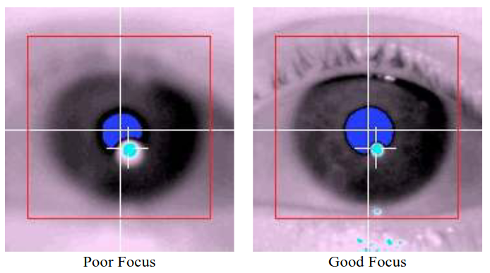
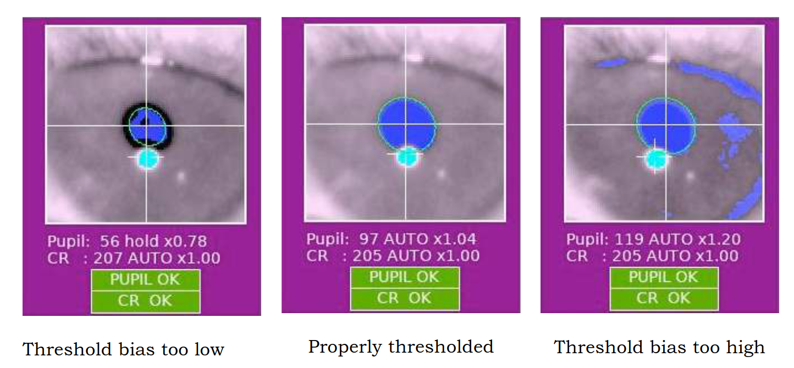
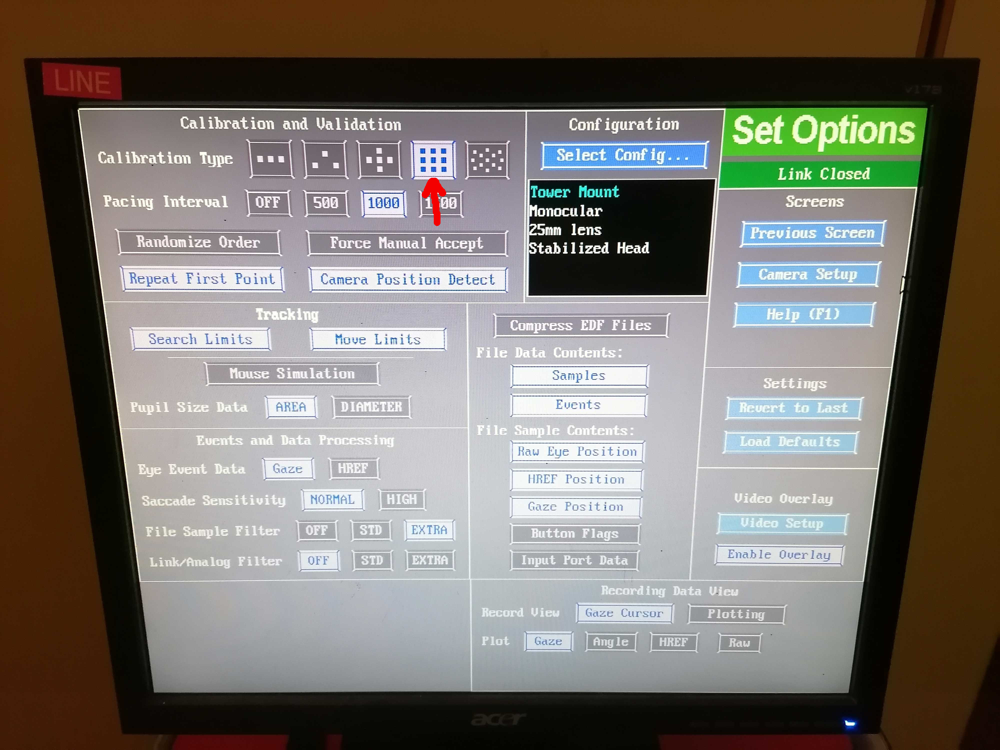

!!! abstract "Please note that some of the images used in this section are sourced from the [ET manual](../assets/files/EL1000Plus_UserManual_1.0.20_GOP.pdf)."

## Setting viewframe and focusing

!!! warning "To ensure accurate performance and prevent minor drifts in the pupil and corneal reflection (CR) thresholds, perform the ET Setup 10-15 minutes after powering the ET on."

- [ ] Open the QCT experiment in *Psychopy* (`task-qct_bold.psyexp` file).
    - [ ] Run the experiment by pressing the green play button.
    - [ ] Press enter to begin the *camera setup mode*.
    - [ ] The camera setup mode contains a view of one eye, and you can switch that view between two modes: one is the field-of-view of the ET, the second is an automatic zoom on the eye itself (or a random part if the eye is not visible).
    - [ ] To ease the setup of the ET, switch to the field-of-view mode in the camera setup mode by pressing the :fontawesome-solid-caret-left: or :fontawesome-solid-caret-right: arrow.
        This will allow you to adjust the ET position as the infrared camera provides feedback inside the scanning room on the projection screen.
- [ ]  Enter the scanning room and adjust the ET arm position and focus of the lens until the eye is fully visible.
    The **right** eye should be visible at the center of the coil's square window for the eye.

    !!! important "Adjusting the camera's field-of-view and focus"

        { align="right" }

        - [ ] To adjust the camera position, slightly unscrew the fixation locks of the camera arm, move the arm in search of the correct position, and tighten the locks again on the desired position.
        - [ ] **If the eye coverage is still inappropriate**, realign the mirror frame position by sliding it along the rails attached to the coil.
            You may ask the participant to do it while inside the bore.
        - [ ] **If the eye coverage is still inappropriate**, re-adjust the participant's head positioning inside the coil.
            You'll need to extract the bed outside of the bore for this by pressing the **Home** (:fontawesome-solid-house:) button.
        - [ ] **If the eye coverage is still inappropriate**, revise the vertical position of the infrared mirror with respect to the standard mirror (this will require new gloves and replacing the tape to stick the infrared mirror).
            Even a tiny adjustment can impact calibration and eye positioning.
        - [ ] Repeat the previous steps until the eye is properly aimed and focused.
        - [ ]  If the image appears blurry, fine-tune the focus using the lens barrel.
            Refer to the example image below.
            

- [ ] Press the A key to set the pupil and CR detection thresholds automatically.
- [ ] Fine-tune the pupil detection threshold using the :fontawesome-solid-caret-up: and :fontawesome-solid-caret-down: arrow keys if necessary.
    While checking the pupil/CR image and thresholding, ask the participant to look at the screen corners to verify correct detection even in extreme positions.
    

- [ ] As a last resort, you can also adjust the strength of the infrared light (emitter).
    This is the black box on the opposite side of the lens on the ET arm.
    Under the emitter there are two little screws.
    Unscrew, move the emitter front/back, check the contrast of the face image, re-screw.
- [ ] Switch the ET to *Eye camera* mode (zoomed in) and check the eye is still well covered by the view and the pupil is segmented.
- [ ] Check that two crosses appear on the eye.
- [ ] If the pupil is correctly seen, as well as the eye (indicated by the crosses following their movement), inform the participant that you are leaving the room, and that you are going to first check with them whether the speaker works well, immediately.
- [ ] Exit the camera mode by pressing Enter.

## Calibration

- [ ] On the eye-tracking (ET) computer, ensure that the appropriate calibration type is selected (9-point for QCT and 5-point for resting state and breath-holding tasks):
    - [ ] Click on Set Options located on the right side of ET computer screen.
    - [ ] Under **Calibration type** in the top left corner, choose the image containing either 9 or 5 points.

        

- [ ] Two crosses should appear on the ET computer screen: one at the center of the pupil and the other at the center of the corneal reflection.

    !!! warning "If the two crosses do not appear, the coverage, focus and intensity of the ET are incorrect"

        - [ ] Repeat the steps for their setting up given [above](#setting-viewframe-and-focusing).

- [ ] Initiate the ET calibration by pressing C on the laptop keyboard or by clicking on Calibration on the ET interface.
- [ ] Once the participant's gaze stabilizes on the first fixation point, the Accept Fixation button turns green.
    Click on it to confirm the initial position.

    

- [ ] Subsequent positions should be automatically validated when the gaze remains stable.
    If not, manually click the Accept Fixation button when it turns green.
- [ ] After the calibration, ensure that the fixation points' positions match the expected pattern corresponding to the 9- or 5-point calibration.
    If the pattern appears too distorted, restart the calibration.
- [ ] Upon successful calibration, initiate validation by clicking Validation on the ET interface or pressing the V key on the laptop keyboard. Follow the same instructions as in the calibration to validate positions.
- [ ] If validation fails, repeat previous steps and restart calibration. Otherwise, you can leave the calibration mode and proceed with the task program by pressing the Esc key on the laptop (*{{ secrets.hosts.psychopy | default("███") }}*).

## Drift check
