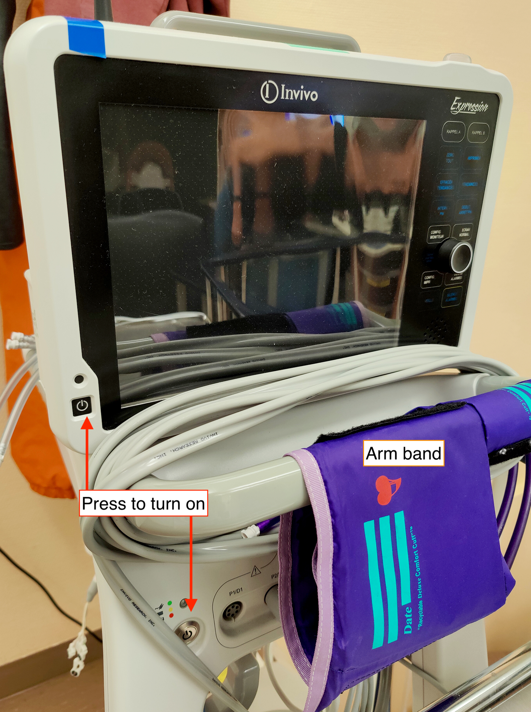
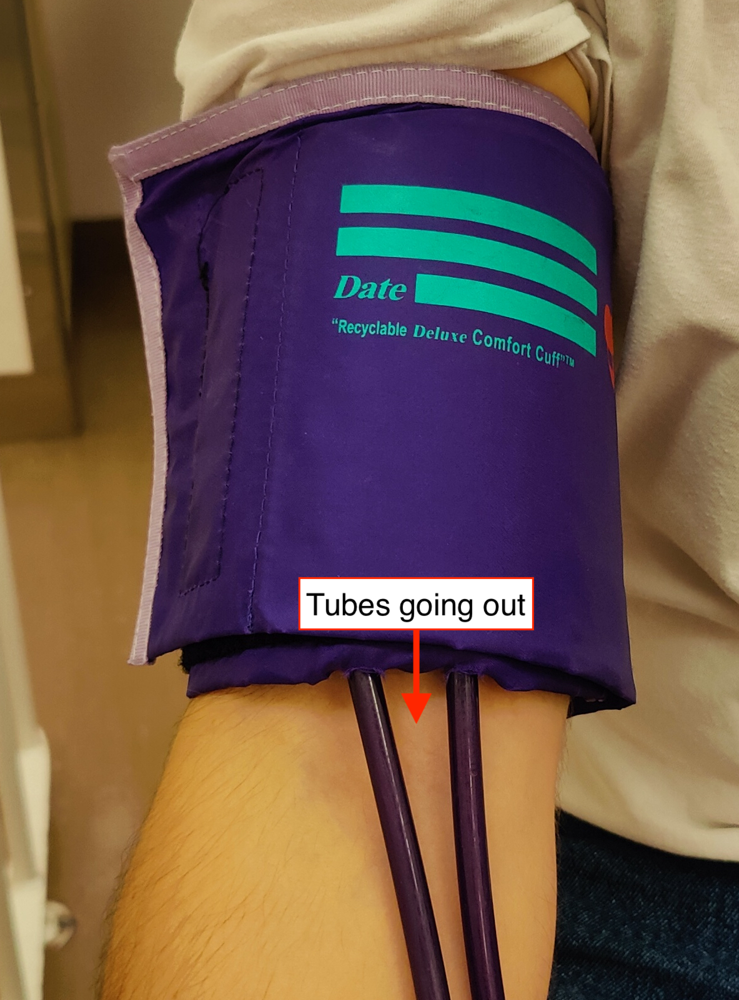

## Measuring blood pressure
- [ ] Turn the blood pressure machine on.
    
- [ ] Carefully place the arm band on the patient's **right** arm.
- [ ] Make sure the tubes are placed correctly (see below).
    
- [ ] Check that the adult preset is loaded (if not, load it).

    ??? info "Load a new preset"

        - [ ] Press **CONFIG MONITEUR** to open the options.
        - [ ] Scroll using the wheel and select by pressing it.
        - [ ] Enter to **PATIENT**, and select **ADULTE**.
        - [ ] Exit by pressing the wheel on **RETOUR**.
        
        
- [ ] Measure the blood pressure by pressing the **DEBUT ARRET** button.
    

## ECG electrodes placement

!!! warning "Ask the participant if they have atopic skin or other skin problems"

    If the participant reports having skin issues, be careful with the following process and do not unnecessarily irritate their skin (e.g., skip the alcohol cleaning and perhaps the abrasion with the preparation gel)

- [ ] Open the sterile cotton gauze pads package, take one and soak it with alcohol.
- [ ] Clean the skin around the three areas with the alcohol-soaked pad with circular movements.
- [ ] Get a second cotton gauze pad and put some *Nuprep* preparation gel and gently abrade the skin by rubbing it onto the skin with four or five circular movements.
- [ ] Remove gel excess with a clean cotton gauze.
- [ ] Remove the protective film from the electrode.
- [ ] Stick the electrode on the participant's skin by starting in one side and ironing the rest of the electrode.
    This procedure ensures that no air is trapped between the electrode and your skin and that no wrinkles from at the edges. Repeat for the three electrodes.
    
