## Protocol setup and management

### Preparing the protocol

- [ ] Close open patients discarding changes.
    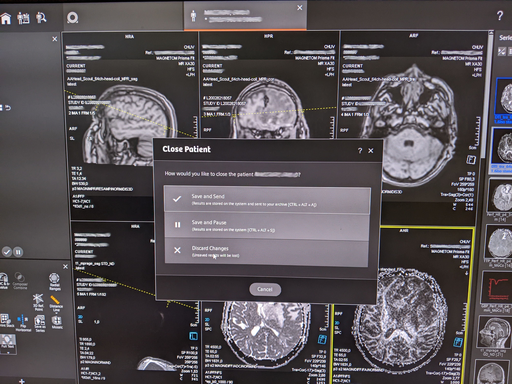
- [ ] Search for the participant by clicking on the "Patient Browser" in the top left corner.
      If the participant is not shown (because it is archived and hence not locally found):
      - [ ] Click on the *DICOM Q/R* button on the top-right area.
          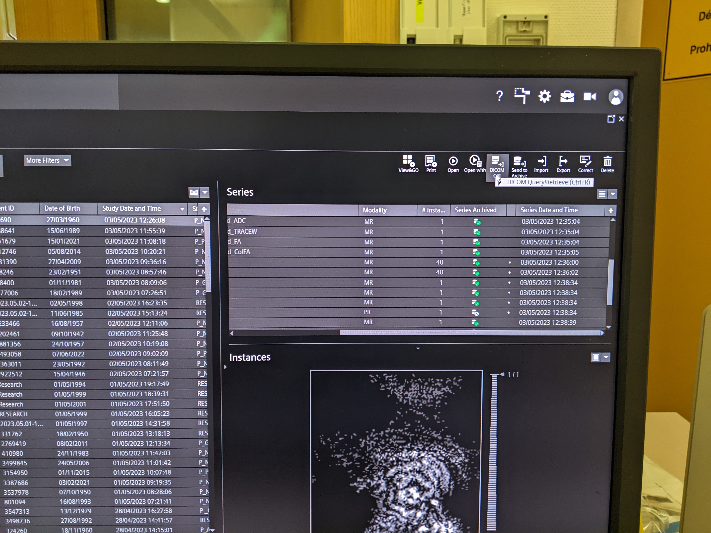
      - [ ] Introduce some unambiguous search criteria:
          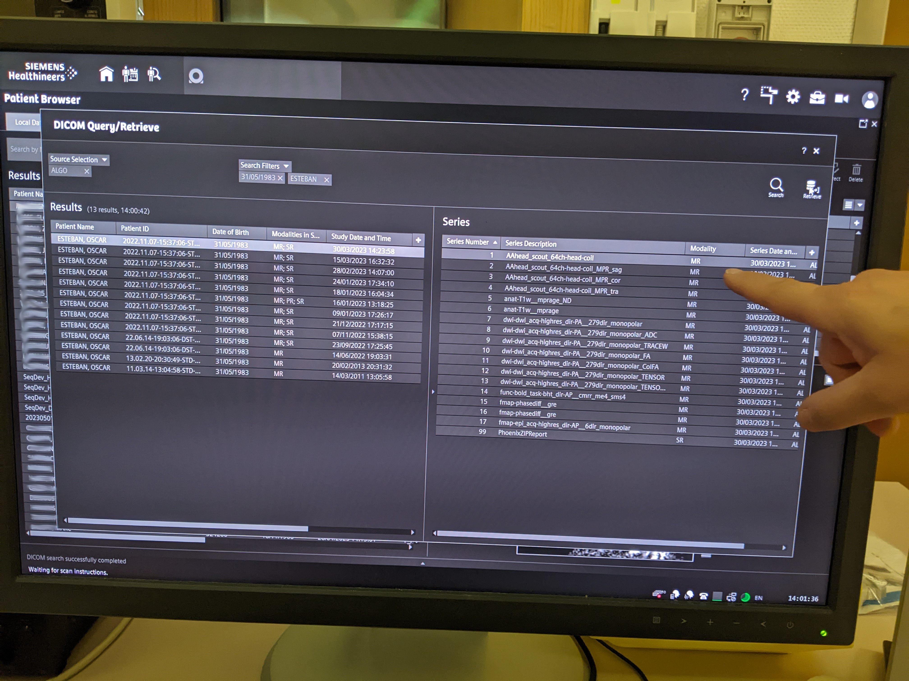
      - [ ] Select the subject (left column) or the sequence (right column) you want to retrieve and hit *Retrieve*. Be careful, **you probably want to retrieve a subject**, that means make sure you have selected a row on the left column:
          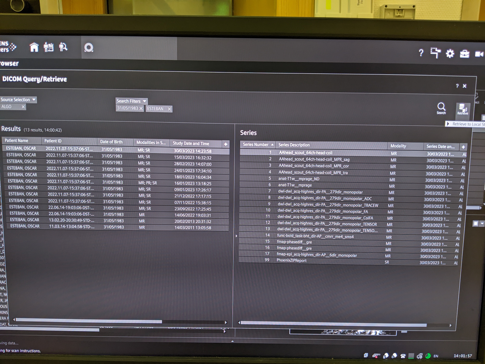
      - [ ] Go back to the "Patient Browser" and check that the patient now shows up in the local search.
- [ ] Check the head coil **is not** plugged before initiating a "New examination" to ensure good SNR of the localizer sequence.
- [ ] Right click and select "New examination".
    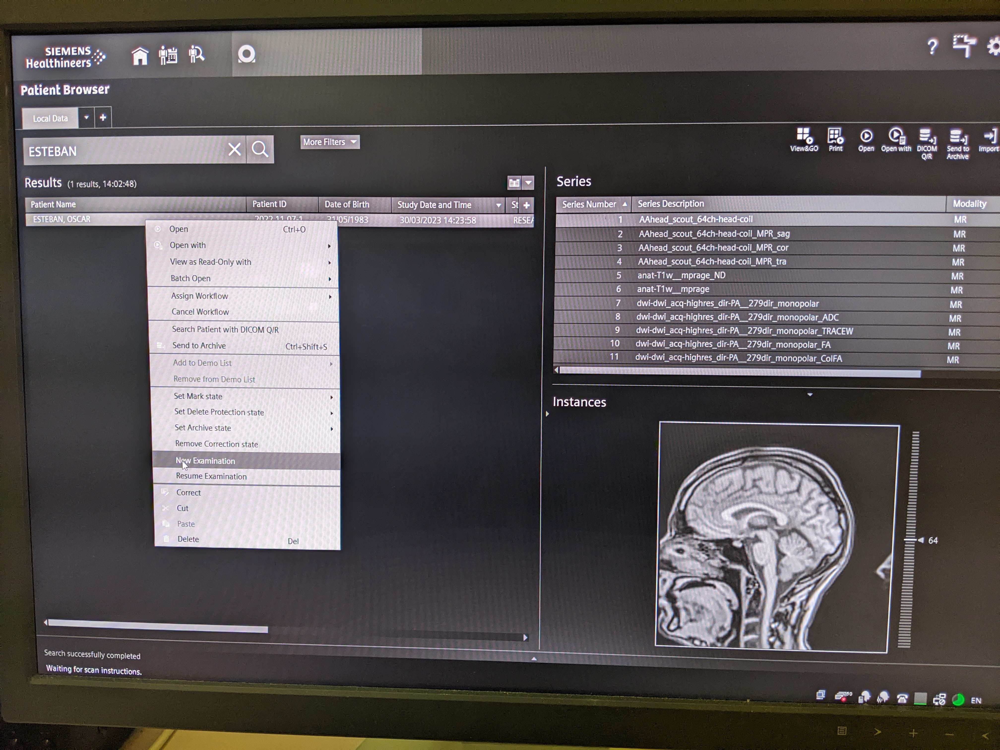
- [ ] Fill in the requested information (e.g., height and weight).
- [ ] Introduce the *Operator* name(s) on the middle column of options, e.g., "ES/AC".
- [ ] In the *Program Selection* tab:
    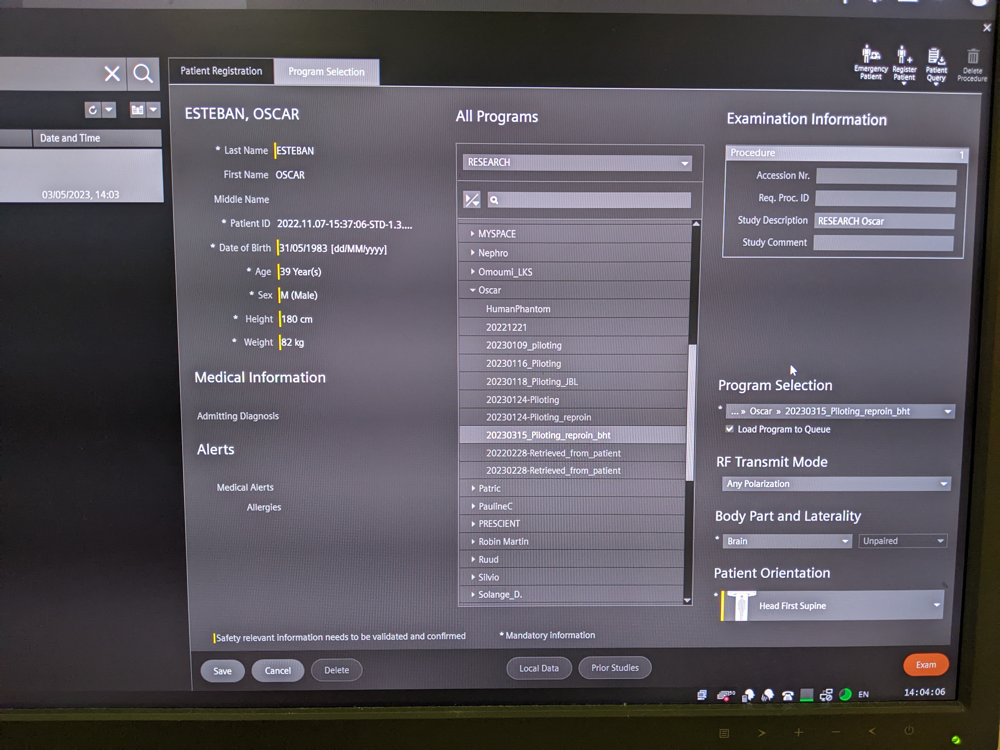
    - [ ] Enter the weight and height of the participant.
    - [ ] Select the right protocol under *RESEARCH* ⤷ *Oscar*.
    - [ ] Select *Brain* as the organ.
    - [ ] Select the *Position* as "Head First Supine".
    - [ ] Before you hit Exam, you can edit general patient's data by changing to the *Patient Registration* tab if you need to edit general information about the patient.
    - [ ] Click the Exam button (red background, rightmost-bottom).

### Editing a sequence
- [ ] Double click on the sequence name.
- [ ] After editing the sequence, you MUST store the changes if you want them to be kept by clicking on the Go button:

    

### Setting sequences for automatic start
- [ ] You can set the worker icon on the left of the sequence by clicking on it if you want to pause before starting that sequence. If the worker is not present, the sequence will launch automatically.

    

- [ ] Blocks with a name between double underscores `__*__` introduce an *Exam Paused* break.
    Such breaks prompt a modal dialog with the *Exam Paused* title like this:

    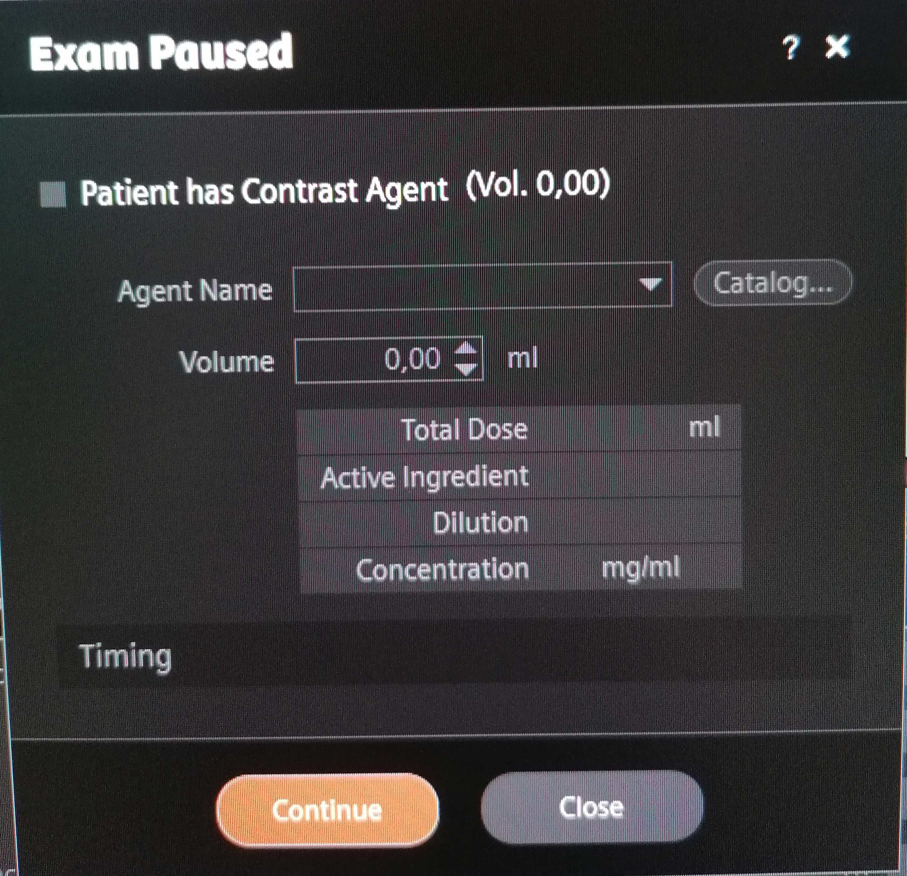

    !!! warning "The *Patient has Contrast Agent* checkbox MUST always be unchecked, as this protocol does not involve a contrast agent""

- [ ] Click Continue when you are ready to proceed.

### Setting the FoV
!!! warning "Using the anatomical image to adjust the field-of-view (FoV) is RECOMMENDED"

    - [ ] Drag and drop the protocol's stack icon (🗇) corresponding to the `anat-T1w__mprage` sequence into the image viewer.
        The icon will appear AFTER the image has been acquired.

- [ ] Make sure that the FOV (yellow square) includes the whole brain by tilting or translating the FOV. If the full brain, including the cerebellum, do not fit in the FOV, favorise making sure that the cortex is fully enclosed in the yellow square. For reproducibility, it is better if the FOV across sequences have a similar center and a similar tilt. However, if it is not possible, the priority remains to include the whole brain in the FOV.
- [ ] If two sequences have the same resolution and the same number of slices, you can copy paste the FOV
    - [ ] Open the sequence for which you want to adjust the FOV/geometry
    - [ ] Right click on the sequence for which the FOV has already been carefully positioned
    - [ ] Select `Copy Parameters`
    - [ ] `Center of slice groups and saturation regions`
- [ ] Once the FOV is well placed, store the new settings of the sequence by pressing Go.

    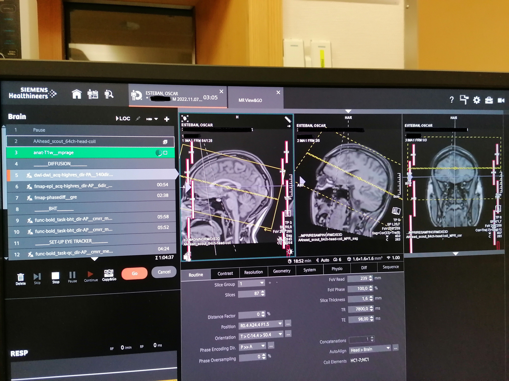

### Repeat scan
- [ ] If you have to interrupt a sequence because a problem occurred (e.g., the participant fell asleep, the stimuli were not adequately started, etc.), or you have to repeat a sequence because the image was of low quality, right click on the sequence that needs to be restarted and click on *Repeat* to restart the scan **without changing anything in its name!**

    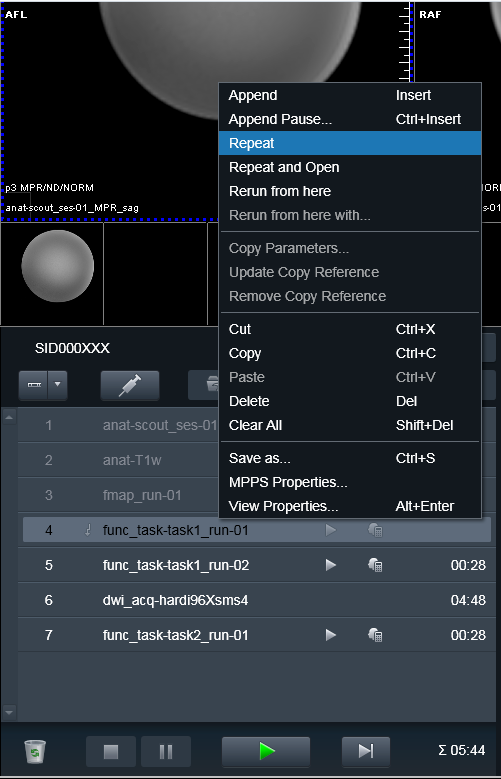

### Managing protocols

- [ ] (Optional) Load an existing protocol
- [ ] Edit the protocol as needed

    !!! important "Follow Reproin conventions"

        When assigning names to the MR sequences in the protocol, make sure to follow the [Reproin conventions](https://dbic-handbook.readthedocs.io/en/latest/mri/reproin.html) to maximally facilitate the conversion into BIDS.

- [ ] Update the *Number of measurements* in all `func-bold_task-*` sequences, according to the [previously recorded timings](intro.md#task-timing):

    $$
    N_\text{measurements} = L_t / \text{TR}, \quad t \in \{\text{bht}, \text{qct}, \text{rest}\},
    $$

    where $L_t$ is the length of a particular task $t$ (either BHT, QCT, or resting state) in seconds as timed before, and
    $\text{TR}$ is the **repetition time** of the BOLD sequence, in seconds.

- [ ] Save the protocol

    !!! warning "Logging in as an advanced user is required before saving the protocol"

        As a good practice, always work as the standard user `{{ secrets.login.username_scanner | default("janedoe") }}`.
        However, you MUST change into *advanced user mode* before saving the protocol.

        Simultaneously press the Tab + Delete + :octicons-sign-out-16: on the control-computer's keyboard:

        > Username: `{{ secrets.login.superusername_scanner | default("superjanedoe") }}`
        >
        > Password: `{{ secrets.login.superuserpass_scanner | default("******") }}`

        !!! danger "After three wrong password entries, access will be denied, and only a Siemens engineer will be able to unlock the MR scanner."

    !!! warning "Some protocol folders on {{settings.mri.models.mri3}} are password-protected."
        To be able to save the protocol into a password-protected folder:

        - [ ] Click on the closed-lock icon (:fontawesome-solid-lock:) placed next to the protected folder's name (`RESEARCH/Oscar` on {{settings.mri.models.mri3}})
        - [ ] Type the password into the modal dialog: {{secrets.login.unlockpass_dotcockpit| default("******") }}

    - [ ] Open the Dot-Cockpit window
        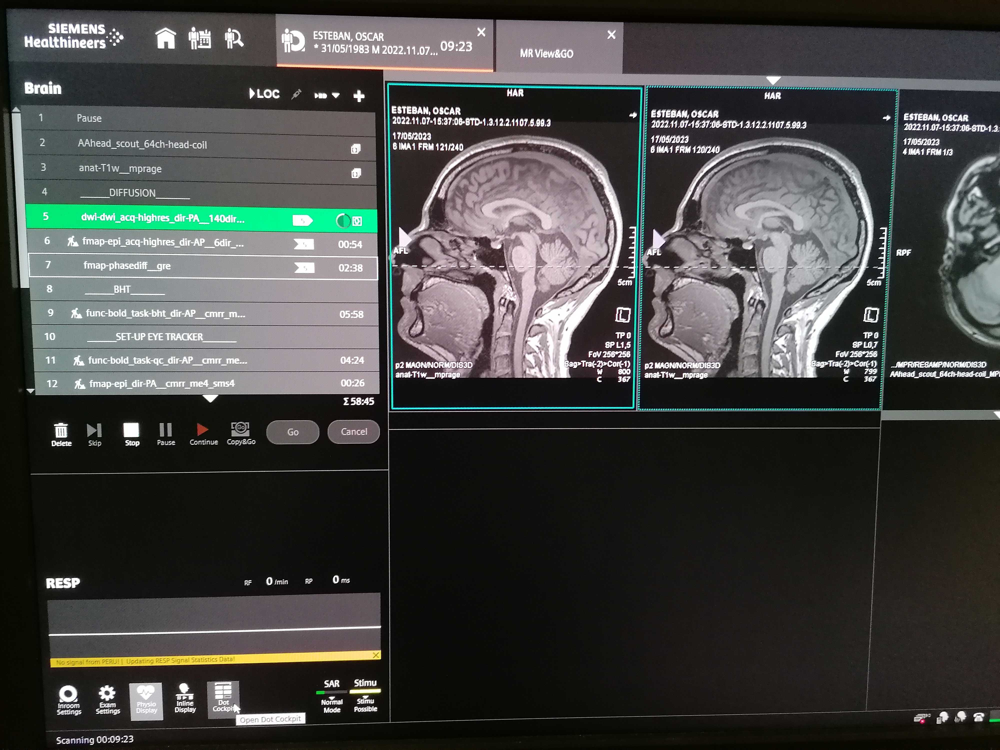
    - [ ] In `Browse`, find the right folder to save the protocol in (*RESEARCH* ⤷ *Oscar*).
    - [ ] Right click on the folder and select *New* ⤷ *Program*. This opens an empty page in the program editor
        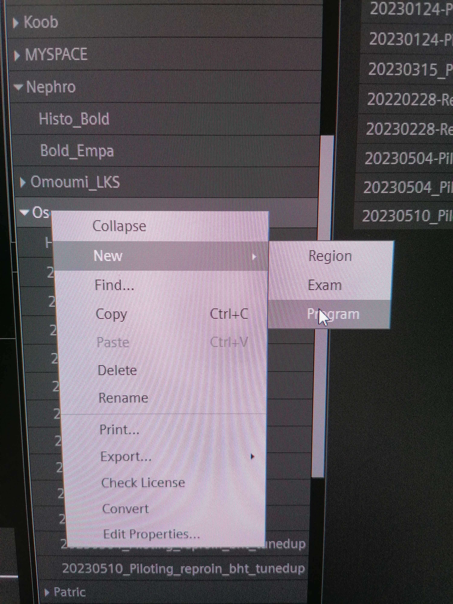
        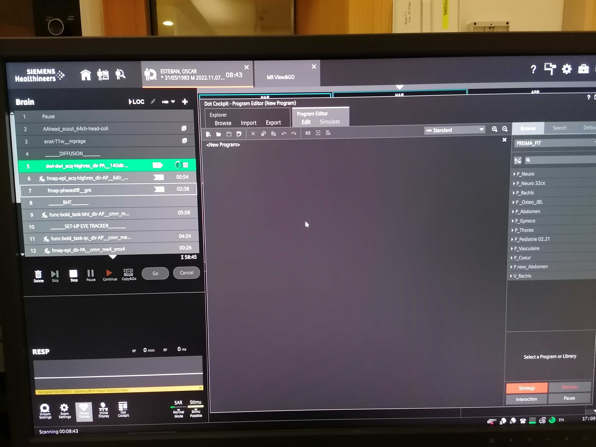
    - [ ] Select all the sequences you want to run from the sequence list and click right to copy.
        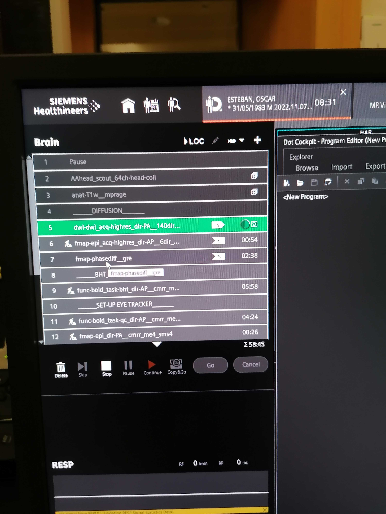
    - [ ] Drag or paste the copied sequences in the program editor.
        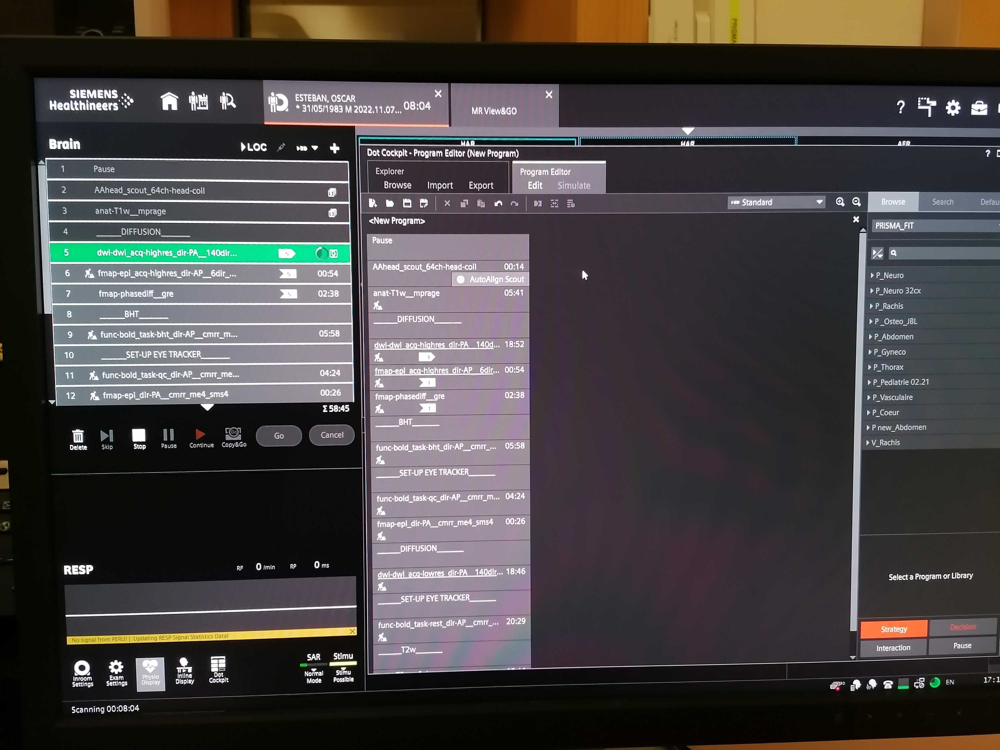
    - [ ] Once finished, click on the floppy disk icon (:fontawesome-solid-floppy-disk:) in the upper left to save.
    - [ ] Give the protocol a relevant name starting with the date of acquisition in the format YYYYMMDD and click Save.
        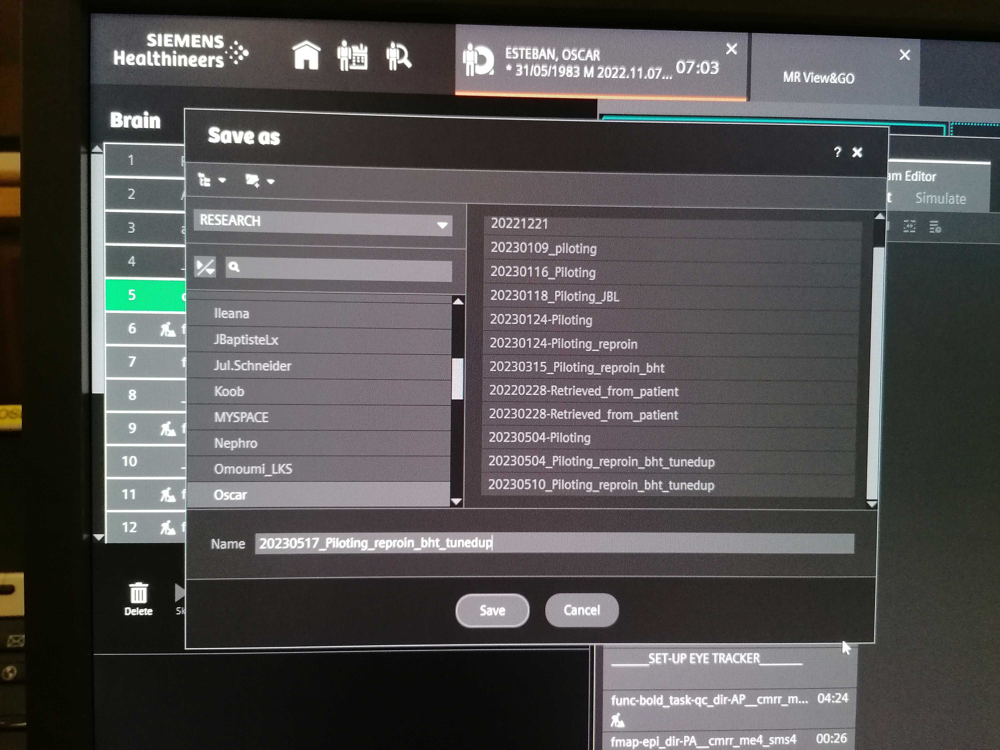
    - [ ] If desired, the protocol details can also be downloaded as a pdf on a peripherical USB key.
        - [ ] Right-click on the protocol and select *Print*
        - [ ] Save the PDF in your USB key.
- [ ] Make sure you save a different protocol for each of the four PE directions (i.e., AP, PA, LR, RL).

### Scanner boot-up protocol

!!! warning "Please wait for all systems to finalize their boot-up (about 10 minutes), even if only the satellite station (*{{ secrets.hosts.console_left | default('██████')}}*) is to be used."

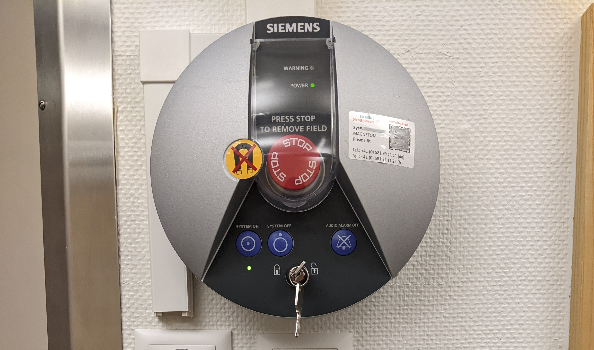

- [ ] Turn the key of the **System ON/OFF Station Box** into the *open lock* position (:fontawesome-solid-unlock:)
- [ ] Push the blue button with the sun symbol :octicons-issue-opened-16: and the **SYSTEM ON** label above, which is found right above the key

### Scanner shutdown protocol

!!! warning "Do not switch the scanner off if some data are yet to be archived"

- [ ] Turn off the satellite station ({{ secrets.hosts.console_left | default("███") }}, the computer on the left side of the control desk)
- [ ] Turn off the control station ({{ secrets.hosts.console_right | default("███") }}, the computer on the right side of the control desk)
- [ ] Wait for both computers to shut down.
- [ ] Push the blue button displaying an overdotted circle and the **SYSTEM OFF** label above, which is found right above the key
- [ ] Turn the key into the *closed lock* position (:fontawesome-solid-lock:)

---

## Scanner interface

The picture below shows you the scanner interface as you will see it when you operate the MR machine. The arrow points to the screen and the red circles indicate the control buttons.
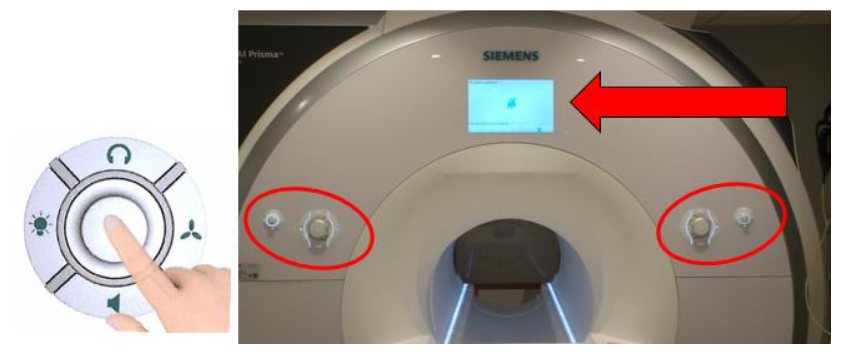

### Scanner's settings buttons

Adjust settings by pressing the respective button and then turning the central knob (1) to adjust the setting to the desired level:

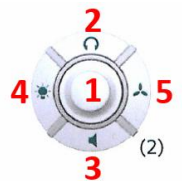

- [ ] Use the headphones :fontawesome-solid-headphones: button (2) to adjust the volume of the earphones.
- [ ] Use the speaker :fontawesome-solid-volume-off: button (3) to adjust the volume of the air speaker in the scanning room.
- [ ] Use the light :fontawesome-solid-lightbulb: button (4) to adjust the intensity of the illumination inside the scanning room.
- [ ] Use the fan :fontawesome-solid-fan: button (5) to adjust the ventilation in the scanning room.

!!! warning "The central knob (button 1) will turn off the alarm if pushed when the alarm is on"

### Communication with the participant

- [ ] Make sure the speaker is audible (and not annoying) and confirm the participant's feedback.
    First, keep the speak mode button (1) pressed while you talk to the participant:

    !!! quote "Hey [NAME], can you hear me well? Is the audio too loud or too low?"

    

- [ ] Enable the feedback channel from the Scanning Room by pressing the listen mode button (2) once.
    Release the speak mode button (1) before you are ready to listen to participant responses.
- [ ] Set the volume control of your microphone and the participant's speaker by pressing the corresponding :fontawesome-solid-plus-minus: buttons on the {{settings.mri.models.mri1}} or slide your finger on the volume line on {{settings.mri.models.mri2}} and {{settings.mri.models.mri3}}.
- [ ] If this volume increase is not enough for the participant to hear you well, proceed as follow:
    - [ ] In the Siemens program, click on Configuration represented by a gear wheel (:fontawesome-solid-gear:) at the top right of the screen.
    - [ ] Click on *Configuration panel*
    - [ ] Under the section *Scan application*, locate the icon of the speaker and tune the volume to the maximum.
    - [ ] Click *Apply*

!!!warning "Emergency buttons"
    The STOP button (3) immediately stops the currently running sequence and will require you to go inside the scanner room and simultaneously press the `bed up` and `bed down` buttons to keep going.
    The crossed-out bell :fontawesome-solid-bell-slash: button (4) stops the alarm if the participant actioned it.

### Participant insertion

- [ ] 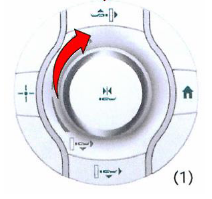{ align="right" width="150px" }
    Move the scanner bed up until it is aligned with the bore's rails.
- [ ] Move the bed forward slowly with the manual regulation knob.
    Stop when the head is under the head-localizer.
- [ ] **Ask the participant to close their eyes**
- [ ] 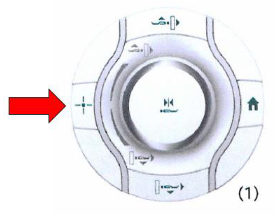{ align="right" width="150px" }
    Press the laser alignment button and align the head-coil markers with the red light.
- [ ] Switch off the alignment light.
- [ ] Inform the participant that they can open their eyes now.
- [ ] 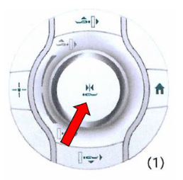{ align="right" width="150px" }
    Move the bed inside the scanner with either of these two options:
    - [ ] manually with the designated knob until the mm counter marks "Isometric", or
    - [ ] press the knob for two seconds, which will place the participant into the isocenter automatically.

### Standard extraction of the participant

There are two options to extract the participant, when the session has concluded or within the session if the participant needs to be extracted and there is no emergency (e.g., in case of technical error the scanner does not permit continuing the session and it needs to be aborted).

| 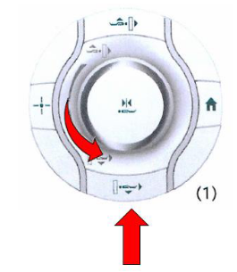 | 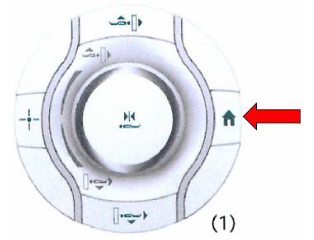 |
|:--:|:--:|
| *The participant can be extracted by pressing the extraction button (bottom arrow in the leftmost picture) and then genly rolling the central knob. Alternatively, you can just press the* Home :fontawesome-solid-house: *button (rightmost picture).* {: colspan=2} |

---

??? thanks "Thanks to Stephanie Bogaert, MSc, Pieter Vandemaele, MSc and Pim Pullens, PhD"
    Some of the pictures in this section have been extracted from the [Ghent Institute for functional and Metabolic Imaging MRI User 2019](http://gifmi.ugent.be/drupal/system/files/documents/GIfMI_MRI%20user%20manual_BASIC_SiemensPrisma_EN.pdf) written by Stephanie Bogaert, MSc, Pieter Vandemaele, MSc and Pim Pullens, PhD.
    We express our gratitude that they put together such a comprehensive guide.
