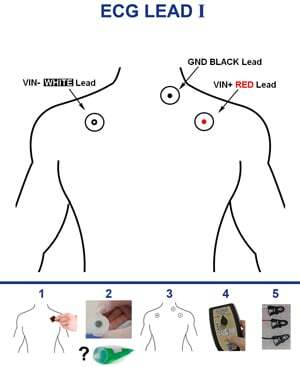
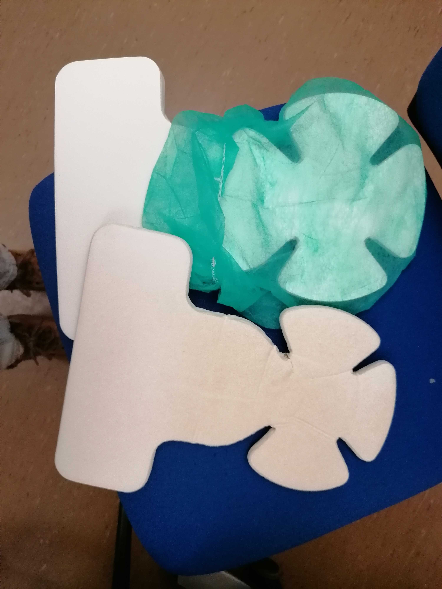
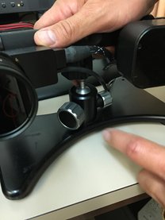

Procedures for when the participant has arrived.

## Preparation of the participant in the CONTROL ROOM

- [ ] Have participant fill out consent documents and MRI safety screener, and verbally confirm responses, paying attention to frequently forgotten devices and implants, like orthodontia
- [ ] Have participant empty their pockets or change into scrubs, and remove all jewelry/hair accessories and check for any missed metallic objects with the scan center's preferred method
- [ ] Instruct participant on staying still and encourage them to request breaks if necessary
- [ ] Describe the participant how the session will develop, with special attention to tasks. Answer all the questions that may arise.
- [ ] Tell the participant they will be holding an alarm button to the participant throughout the session, and that they may use it any time whenever they need to stop the experiment.
    - [ ] Tell the participant that they MUST leave the alarm button, e.g., on their belly, during the positive control task. Indicate that you will remind them of this before starting the task.
- [ ] Indicate the participant where the door to the changing room is, and ask them to change clothes if necessary.
- [ ] Ask the participant to place the ECG electrodes on the location indicated by the picture below.
    - [ ] Clean the skin with [WHAT?]
    - [ ] Remove the protective film from the electrode
    - [ ] Stick the electrode on your skin by starting in one side and ironing the rest of the electrode. This procedure ensures that no air is trapped between the electrode and your skin and that no wrinkles from at the edges. Repeat for the three electrodes
        

## Preparation of the scanning protocol (control console)

- [ ] Close open patients discarding changes.
    
- [ ] Search for the participant by clicking on the "Patient Browser" in the top left corner
      If the participant is not shown (because it is archived and hence not locally found):
      - [ ] Click on the *DICOM Q/R* button on the top-right area.
          
      - [ ] Introduce some unambiguous search criteria:
          
      - [ ] Select the subject (left column) or the sequence (right column) you want to retrieve and hit *Retrieve*. Be careful, **you probably want to retrieve a subject**, that means make sure you have selected a row on the left column:
          
      - [ ] Go back to the "Patient Browser" and check that the patient now shows up in the local search.
- [ ] Check the head coil **is not** plugged before initiating a "New examination" to ensure good SNR of the localizer sequence.
- [ ] Right click and select "New examination".
    
- [ ] In the *Program Selection* tab:
    
    - [ ] Enter the weight and height of the participant
    - [ ] Select the right protocol under "Oscar"
    - [ ] Select *Brain* as the organ
    - [ ] Select the *Position* as "Head supine"
    - [ ] Click the "Exam" button (red background, rightmost-bottom)
    - [ ] Before you hit "Exam", you can edit general patient's data by changing to the *Patient Registration* tab if you need to edit general information about the patient.

- [ ] Load the adequate protocol, making sure of loading the right phase-encoding (PE) direction corresponding to the session.
    - [ ] Double-check that all PE prescriptions are correct.

## Installing the participant in the SCANNING ROOM

- [ ] Bring the participant inside the room, and give them the ear-plugs to protect the hearing during acquisition.
- [ ] Connect the ECG leads on the three electrodes. The electrodes MUST be connected following the color scheme [ADD DETAILS]
- [ ] Install the respiration belt below the participant's chest and connect it to the tube [INSERT PHOTO]. The respiration belt measure the displacement of the stomach induced by breathing, it thus needs to surround the stomach comfortably. [GIVE MORE PRECISE INFO WHERE SHOULD IT BE PLACED]
- [ ] Place the nasal cannula in the nose of the participant making sure the two protrusion are aligned with the nostrils of the participant. Place the tube behind the ears and tighten behind the head for comfort and stability by sliding the ring.
- [ ] Give to the participant the emergency button. Make the participant try it, so they can see it works. To switch off the alarm, there's a button on the scanner (circular, both on the left and on the right of the hole) 
- [ ] Adjust the participant inside. With the paddings, their head position MUST be adjusted and elevated so that the nose and the forehead of the participant are both close to the upper coil. This procedure ensures the ET has the clearest possible view of eye.
- [ ] This part must be repeated taking out and putting back the upper part of the head-coil, adjusting the pillow at every step, until the head is fixed and the nose and forehead of the participant almost touch the coil. In case of need, ask the participant to "say yes" with the head (chin on neck) and keep this position, place the pillows, place the coil and check that the participants' front touches the coil. Now the nose can also be a bit far from the coil. Tell the participant to relax the neck, so the nose should go a bit up and touch the coil.  
    
    
- [ ] Take the Ears -protection pillow, stick it on top of the ears of the participant, one by one. Once they are settled, you can pump it, until the participant is comfortable, the head is fixed and the ears are protected.
- [ ] Ask the participant if they are feeling cold. Cover them with a blanket if necessary.
- [ ] Solicit feedback on participant's comfort while positioning them on the scanner bed and suggest ergonomic positioning of arms to avoid discomfort. Remind the participant not to create closed loops by crossing their legs or holding their hands together.
- [ ] Gently move the participant with the manual regulation. Stop when the head is under the head-localizer. Ask the participant to close their eyes, press the laser alignment button and align the head-coil markers with the red light.
- [ ] Switch off the alignment light, now the participant can open their eyes. You can move the participant (always gently as before) inside the scanner, until the mm counter marks "Isometric".
- [ ] Go behind the scanner, push the plexiglas panel until it touches the bed.
- [ ] You should see the projection of the calibration mode as you left it open before.
- [ ] Regulate the ET position until you see from the projector screen the eye. In case of need, you can adjust the strength of the infrared light (emitter). This is the black box on the other side with respect to the lens. Under the emitter there are two little screws. Unscrew, move the emitter front/back, check the contrast of the face image, re-screw. Once the eye is well seen, the image is zoomed (externally by the operator in front of the PC-tower) to the pupil. The right lens MUST be manipulated rotating the roller, like what you would do with your reflex to obtain the focus. If the position of the ET is not satisfying, you can move the base.
    
- [ ] If the pupil is correctly seen, as well as the eye, you can go out.
    - [ ] Inform the participant that you are leaving the room, and that you are going to first check with them whether the speaker works well, immediately
- [ ] Make sure the speaker is audible (and not annoying) and confirm the participant's feedback:

    > Hey [NAME], we are about to start the scanning session.
    > First, we are going to calibrate the eye tracker. Please follow the small circle on the screen.
    > It's going to move around the screen. Please focus your gaze and follow it when it moves.

- [ ] Switch the ET camera back to zoomed mode, and exit the camera mode.
- [ ] Inform the participant about the calibration process.
    - [ ] Ask the participant to follow a fixation point with their gaze, without moving their head.
    - [ ] Tell the participant to move the eyes ONLY after the point moves (do not anticipate).
    - [ ] When the gaze is stable and the validate button [VERIFY THE EXACT NAME] appears green, you can manually click on it to validate the first position.
    - [ ] The following positions should be validated automatically when the gase is stable enough. If it is not the case, manually click on the validate button when it turns green
- [ ] The ET software MUST show a cross during the calibration. If it does not, try sequentially the following:
    - [ ] readjust the focus of the ET; and if it still doesn't show the cross,
    - [ ] readjust the mirror frame position sliding it throught the rails attached to the coil; and if it still doesn't show the cross,
    - [ ] readjust the participant's head positioning inside the coil; and if it still doesn't show the cross,
    - [ ] move the mirror up or down (being careful as mentioned before). Just a few mm can ruin the calibration and the eye-position; and if it still doesn't show the cross,
    - [ ] iterate over the previous steps.
- [ ] When the calibration is successful, launch the validation by clicking on validation on the ET interface or clicking V on the keyboard of the laptop. Follow the same instructions as in the calibration to validate the positions.
- [ ]  Turn the pump of the GA on  and make sure the flow control is set on maximum.
