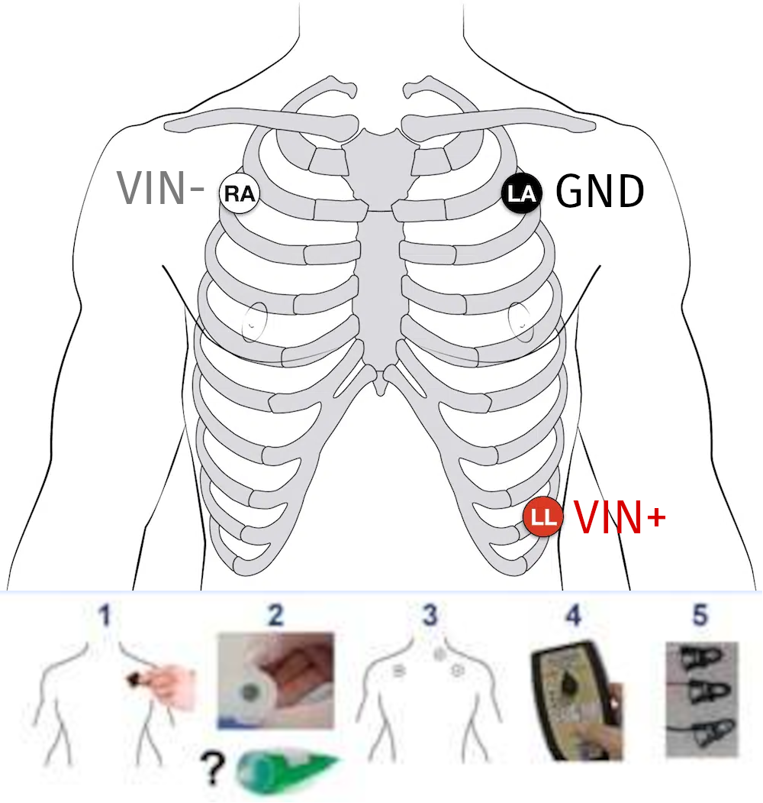

!!!warning "Procedures for when the participant has arrived"
    It is critical to stay alert and anticipate any potential risk to the participant to avert them.
    This is particularly important for the first session.

## Preparation of the participant in the CONTROL ROOM

### Participant reception
- [ ] Meet the participant at an easily locatable place (e.g., the reception desk of the Radiology Unit) and show them the way into the control room. <mark>Allow sufficient time before the experiment for the preparation (min. 30 minutes)</mark>.
- [ ] Show the participant the scanning room and explain to them how the device is controlled from outside.
- [ ] Ask the participant to fill out the consent form and MRI safety screener, and verbally confirm responses, paying attention to frequently forgotten devices and implants, like orthodontia.

    !!!danger "DO NOT subject the participant to any risk"
        - [ ] In case of any doubts emerging from the MRI safety screening, contact {{ secrets.people.medical_contact | default("███") }} immediately at {{ secrets.phones.medical_contact | default("███") }}. **DO NOT PROCEED** if the medical contact cannot be reached.
        - [ ] In case of discovering any previously undisclosed contraindication, the volunteer **MUST NOT** participate in the study.

- [ ] Remind the participant to use the bathroom at this moment if they need ({{ secrets.rooms.bathroom | default("███") }}).

    !!!warning "Only female participants, only the first session"
        - [ ] Remind the participant that for their safety, pregnant women cannot participate:

            > Hey [NAME], I have to remind you that pregnant women cannot participate for their safety.
            > To be absolutely sure that you are not scanned while being pregnant, the ethical review board requests us that you take a pregnancy test before the first session.
            > Here you have a test, and this is the urine sample cup.
            > I'm going to show you the bathroom now so that you can do the test with the necessary privacy.

        - [ ] Provide the participant with a pregnancy test and a urine sample cup.
        - [ ] Go over the instructions with them.
        - [ ] Accompany them to the bathroom (situated at {{ secrets.rooms.bathroom | default("███") }}), and ask whether there is anything else they anticipate they will need.
        - [ ] If the test is positive, the person **CANNOT PARTICIPATE** in the study. <mark>You MUST be understanding of the situation as most likely the person will not be aware of the circumstance</mark>.

- [ ] Instruct the participant on how to use the alarm button:

    ???+ quote "Alarm button should be used when needed"
        During the duration of the exam, you'll have an alarm button on your hand.
        You can use it at any moment.
        We will first talk with you to check everything is fine, and we will stop the session whenever you need to stop the experiment.
        There is no need for you to endure uncomfortable experiences or anxiety (for instance, if you feel claustrophobic)

### Describing the development of the session
- [ ] Describe the participant how the session will develop, with special attention to tasks. In the first session, show the task while explaining them for clarity. Let them interrupt you to ask for clarifications and answer all the questions that may arise.

    ???+ quote "Script for the first session"

        We are going to acquire three types of images.
        The first type is anatomical imaging that we use to study the morphology of the brain.
        The second type is diffusion MRI, which we use to infer the pathways of major fiber bundles showing how the different regions of the brain may be interconnected.
        Finally, we collect functional MRI, which we use to understand how the brain activates as a response to stimuli we will present to you.
        During the whole duration of the exam, please do not create closed loops by crossing your legs or holding your hands together.
        It is possible that your peripheral nerves get stimulated at some points, so you will feel twitching of muscles, for instance, of your pectorals.
        Do not panic, it is okay, but if it feels too uncomfortable, please squeeze the alarm button.

        For the anatomical and the diffusion MRI we just ask you to relax and try to stay as still and comfortable as possible.
        Like a photographic camera, the largest problem making analyses difficult is motion.
        As opposed to a photo camera, the imaging of the brain happens very slow so there is a lot of opportunity for involuntary movements (e.g., when you blink or you take a deeper breath) or semi-voluntary (e.g., you need to swallow).

        The functional MRI is a bit more entertaining, as we will ask you to engage in different behavioral activities.
        The first functional block is what we call a positive-control task, that will tell us little about your brain but will help us determine if there are confounding signals intermixed with your data.
        In this positive-control task, you will be shown a fixation point with the shape of a circle.
        Whenever you see that fixation point, please focus your gaze at the center of it.
        At points the fixation point will browse around the screen.
        When that happens, please follow it with your eyes taking care of not moving your head with the eye movement.
        Other times it will be fixed on the center, and have a blank gray background or a flickering or grating circular area behind it.
        The last element of this block will show the words LEFT or RIGHT.
        When either appears, please tap your thumb on each of the your other four fingers of the hand designated by the word, sequentially with all fingers and reversing the direction at the extremes (your pointer and your pinkie).
        This positive-control task has a length of {{ settings.mri.timings.func_pct }}.
        During this task, please leave the alarm button on your tummy, where you can recover it when it finishes.

        Then there is a long block of {{ settings.mri.timings.func_rest }} that we call *resting* state.
        During this block, all you have to do is stay still and look at the movie.
        Please do not close your eyes.

        Finally, a breath-holding task will help us understand the signals elicited by your breathing that are detected by the scanner.
        This block has a length of {{ settings.mri.timings.func_bht }}.
        You will watch five repeats of the same block.
        Each block will show you a colored rectangle in the middle.
        The green rectangle means *breathe in*, the yellow rectangle means *breathe out*, and the red rectangle means *hold your breath*.
        The last two green and yellow rectangle will be shown on a lighter green and orange color respectively to signal you that a hold will follow immediately after the breathe-out.
        The red rectangle will turn pink to indicate that you will soon be able to breathe-out any remaining air in your lungs and breathe in again.
        Please remember to breathe out after the breath-hold.
        When no rectangle is presented, you can breathe as it feels more comfortable to you.
        The first of the blocks is a mock.
        That will be reminded to you at the beginning of the task on the screen.
        During the mock block, please look at the stimuli on the screen but keep your habitual breathing pace disregarding the task instructions.
        At the end of this mock block, a message will remind you must follow the task instructions from that moment on.
        that you must adapt your breathing to the pace indicated by the color-changing rectangle in the center of the screen for the remaining four repetitions of the block.

        Is everything clear to you? Do you have any questions?

    ???+ quote "Script for the following sessions"

        As you probably remember, we acquire three types of images.
        For two of them you just stay still in the scanner, but we will also require your collaboration for the third, which is functional MRI.
        During the whole duration of the exam, please do not create closed loops by crossing your legs or holding your hands together.
        It is possible that your peripheral nerves get stimulated at some points, so you will feel twitching of muscles, for instance, of your pectorals.
        Do not panic, it is okay, but if it feels too uncomfortable, please squeeze the alarm button.

        Let's quickly recap the functional MRI tasks.
        The first is the positive-control task, you will be shown a fixation point with the shape of a circle that you must follow with your gaze wherever it goes and then the words LEFT or RIGHT while which you tap your fingers like this (remind to them).
        During this task, please leave the alarm button on your tummy, where you can recover it when it finishes.

        Then there is a long block of about 20 minutes that we call *resting* state, where you will be watching a movie.
        During this block, all you have to do is stay still and please do not close your eyes.

        Finally, the breath-holding task where you will watch five repeats of the same block with colored rectangles in the middle.
        The green rectangle means *breathe in*, the yellow rectangle means *breathe out*, and the red rectangle means *hold your breath*.
        The last two green and yellow rectangle will be shown on a lighter green and orange color respectively to signal you that a hold will follow immediately after the breathe-out.
        The red rectangle will turn pink to indicate that you will soon be able to breathe-out any remaining air in your lungs and breathe in again.
        Please remember to breathe out after the breath-hold.
        When no rectangle is presented, you can breathe as it feels more comfortable to you.
        The first of the blocks is a mock.
        That will be reminded to you at the beginning of the task on the screen.
        During the mock block, please look at the stimuli on the screen but keep your habitual breathing pace disregarding the task instructions.
        At the end of this mock block, a message will remind you must follow the task instructions from that moment on.
        that you must adapt your breathing to the pace indicated by the color-changing rectangle in the center of the screen for the remaining four repetitions of the block.

        Is everything clear to you? Do you have any questions?

### Finalizing the preparation
- [ ] Offer the participant a box to deposit everything they have in their pockets and all jewelry/hair accessories, and indicate the clothing to enter the scanning room:

    ??? quote "*Dress code* inside the scanner **if they need to CHANGE INTO SCRUBS**"
        Before we continue, we need to make sure we do not introduce any dangerous object in the magnet room.

        Here you will find a changing room [SHOW THEM THE CHANGING ROOM].
        I have prepared some scrubs for you.
        Please remove all your clothes and leave them in the changing room.
        Please keep your underwear on [if a woman, ask whether **their undergarment DOES NOT contain any large metallic part** such as shaping guides, and request their removal if they do].

    ???+ quote "*Dress code* inside the scanner **if they CAN WEAR THEIR CLOTHES**"
        Before we continute, we need to make sure we do not introduce any dangerous object in the magnet room.

        Please deposit here all your belongings, your belt, your glasses, your jewelry and any accessories, piercings, etc. that you have on you.
        If a woman, ask whether **their undergarment DOES NOT contain any large metallic part** such as shaping guides, and request their removal in the changing room.

- [ ] Help the participant to prepare their skin and place the ECG electrodes:

    !!! warning "Ask the participant if they have atopic skin or other skin problems"

        If the participant reports having skin issues, be careful with the following process and do not unnecessarily irritate their skin (e.g., skip the alcohol cleaning and perhaps the abrasion with the preparation gel)

    - [ ] Open the sterile cotton gauze pads package, take one and moisten it with alcohol.
    - [ ] Clean the skin around the three areas with the alcohol-soaked pad with circular movements.
    - [ ] Get a second cotton gauze pad and put some *Nuprep* preparation gel and gently abrade the skin by rubbing it onto the sckin with four or five circular movements.
    - [ ] Remove gel excess with a clean cotton gauze.
    - [ ] Remove the protective film from the electrode.
    - [ ] Stick the electrode on the participant's skin by starting in one side and ironing the rest of the electrode. This procedure ensures that no air is trapped between the electrode and your skin and that no wrinkles from at the edges. Repeat for the three electrodes.
        

## Preparation of the scanning protocol (control console)

- [ ] Close open patients discarding changes.
    
- [ ] Search for the participant by clicking on the "Patient Browser" in the top left corner.
      If the participant is not shown (because it is archived and hence not locally found):
      - [ ] Click on the *DICOM Q/R* button on the top-right area.
          
      - [ ] Introduce some unambiguous search criteria:
          
      - [ ] Select the subject (left column) or the sequence (right column) you want to retrieve and hit *Retrieve*. Be careful, **you probably want to retrieve a subject**, that means make sure you have selected a row on the left column:
          
      - [ ] Go back to the "Patient Browser" and check that the patient now shows up in the local search.
- [ ] Check the head coil **is not** plugged before initiating a "New examination" to ensure good SNR of the localizer sequence.
- [ ] Right click and select "New examination".
    
- [ ] In the *Program Selection* tab:
    
    - [ ] Enter the weight and height of the participant.
    - [ ] Select the right protocol under *RESEARCH* ⤷ *Oscar*.
    - [ ] Select *Brain* as the organ.
    - [ ] Select the *Position* as "Head First Supine".
    - [ ] Before you hit Exam, you can edit general patient's data by changing to the *Patient Registration* tab if you need to edit general information about the patient.
    - [ ] Click the Exam button (red background, rightmost-bottom).

- [ ] Load the adequate protocol, making sure of loading the right phase-encoding (PE) direction corresponding to the session.
    - [ ] Double-check that all PE prescriptions are correct.

## Installing the participant in the SCANNING ROOM

??? thanks "Thanks to Stephanie Bogaert, MSc, Pieter Vandemaele, MSc and Pim Pullens, PhD"
    Some of the pictures in this section have been extracted from the [Ghent Institute for functional and Metabolic Imaging MRI User 2019](http://gifmi.ugent.be/drupal/system/files/documents/GIfMI_MRI%20user%20manual_BASIC_SiemensPrisma_EN.pdf) written by Stephanie Bogaert, MSc, Pieter Vandemaele, MSc and Pim Pullens, PhD. We express our gratitude that they put together such a comprehensive guide.

- [ ] Have the participant remove their shoes at the entrance of the scanning room.
- [ ] Show the alarm button to the participant and explain how they may use it.
- [ ] Give to the participant the emergency button. Make the participant try it, so they can see it works. To switch off the alarm, there's a button on the scanner (circular, both on the left and on the right of the hole)
- [ ] Give them the ear-plugs to protect their hearing during acquisition, allow time for them to place them.
- [ ] Instruct the participant to lay on the MRI bed.

### Connecting physiological recording sensors and probes
- [ ] Connect the ECG leads to the three electrodes. The electrodes MUST be connected following the color scheme shown in the picture above.
- [ ] Install the RB below the participant's chest and connect it to the tube as shown in the picture below. The RB measures the stretching induced by breathing, so it MUST surround the chest or stomach comfortably. Positioning the RB higher (chest) or lower (stomach) depends on the individual's preferential respiration mode (chest breathing or diaphragmatic, respectively).
- [ ] Place the nasal cannula in the nose of the participant making sure the two protrusions are aligned with the nostrils of the participant. Place the tube behind the ears and tighten under the chin for comfort and stability by sliding the ring as shown in the picture above.

    

- [ ] When completely laying down on the bed, tightly fasten the RB and check with the participant whether they are too uncomfortable.
- [ ] Check the *AcqKnowledge* signal visualization of the adjustment of the RB, and make sure that the signal is not saturating (when the RB is too tight) or too weak (when the RB is too loose).
    !!! warning "Two-people protocol to check the RB settings."

        This check requires two experimenters, one INSIDE (**IN**) the scanning room and one more outside (**OUT**)
        
        - [ ] **OUT** indicates they are ready to start the check by signaling a THUMBS-UP WITH BOTH HANDS through the Scanning Room window (:fontawesome-solid-thumbs-up: :fontawesome-solid-thumbs-up:).
        - [ ] **IN** MUST confirm they understand returning the THUMBS-UP WITH ONE HAND :fontawesome-solid-thumbs-up:.
        - [ ] **IN** finalizes the setting of the RB if necessary and asks the participant to breathe normally.
        - [ ] Once the participant is lying down on the bed and breathing normally, and the check can be carried out, **IN** MUST signal they are ready by sending a THUMBS-UP WITH BOTH HANDS  (:fontawesome-solid-thumbs-up: :fontawesome-solid-thumbs-up:) through the window.
        - [ ] **OUT** MUST acknowledge the understanding, return a THUMBS-UP WITH BOTH HANDS  (:fontawesome-solid-thumbs-up: :fontawesome-solid-thumbs-up:), and check the *AcqKnowledge* screen.
        - [ ] **OUT** checks for signs of saturation and insufficient dynamic range.
            These issues manifest as plateaus and excessively flat lines (respectively) in the *AcqKnowledge* visualization of the RB signal.
        - [ ] **OUT** provides feedback to the inside room as follows:
            * If the RB must be **tightened* up, pointer finger going up (:fontawesome-solid-hand-point-up:);
            * if the RB must be **loosened* up, pointer finger going down (:fontawesome-solid-hand-point-down:);
            * if **OUT** needs to check again, they show two hands ((:fontawesome-solid-hand: :fontawesome-solid-hand:), checks the *AcqKnowledge* again and signs another instruction; and
            * if the check is finished, **OUT** signs a THUMBS-UP WITH BOTH HANDS  (:fontawesome-solid-thumbs-up: :fontawesome-solid-thumbs-up:).
            * **IN** MUST acknowledge all the commands with THUMBS-UP WITH ONE HAND :fontawesome-solid-thumbs-up: if understood. If not understood, they can request with a PRAYING gesture (:fontawesome-solid-hands-praying:)
            
- [ ] Solicit feedback on participant's comfort while positioning them on the scanner bed and suggest ergonomic positioning of their arms to avoid discomfort.
- [ ] Once the subject is lying on the MR bed, check that no arms/legs lie on the GA or the RB tubes.

    

### Accommodating the participant's head in the coil

- [ ] Adjust the participant inside. With the paddings, their head position MUST be adjusted and elevated so that the nose and the forehead of the participant are both close to the upper coil. This procedure ensures the ET has the clearest possible view of eye.
- [ ] This part must be repeated taking out and putting back the upper part of the head-coil, adjusting the pillow at every step, until the head is fixed and the nose and forehead of the participant almost touch the coil. In case of need, ask the participant to rotate their head like when *saying yes* until reaching an adequate position, place any remaining paddings.
    
    
- [ ] Take the side paddings and fit them between each ear and the coil. If using the inflatable padding, pump air into them without making the participant uncomfortable (check with them).

    

- [ ] Cut a long strip of medical auto-adhesive band and stick it at each side of the lower block of the head coil, across the participant's forehead and stick it to the participant's forehead. Indicate the participant that this band will tell them when they moved and help them recover the original position.
- [ ] Place the top block of the coil and check that the participants' front touches or is really close to the coil. Now the nose can also be a bit far from the coil. Tell the participant to relax the neck, so the nose should go a bit up and touch the coil.
- [ ] Connect the coil's cable to the corresponding socket on the table.
- [ ] Ask the participant if they are feeling cold. Cover them with a blanket if necessary.
- [ ] Place rectangular paddings at each side of the chest and help the participant accommodate their elbows on them.
- [ ] Remind the participant not to create closed loops by crossing their legs or holding their hands together.
- [ ] Gently move the participant with the manual regulation. Stop when the head is under the head-localizer. **Ask the participant to close their eyes**, press the laser alignment button and align the head-coil markers with the red light.

    |  |
    |:--:|
    |  |

- [ ] Switch off the alignment light, now the participant can open their eyes. You can move the participant (always gently as before) inside the scanner manually, until the mm counter marks "Isometric" or you can press the rotary knob for two seconds. This will send the participant to the isocenter automatically.

    

### Final preparatory steps of the ET

Please note that some of the images used in this section are sourced from the [Eye Tracker Instruction Manual](../assets/files/EL1000Plus_UserManual_1.0.20_GOP.pdf).

!!! warning "To ensure accurate performance and prevent minor drifts in the pupil and CR thresholds, perform the ET Setup 10-15 minutes after powering the ET on."

- [ ] Open the PCT experiment in *Psychopy* (`task-pct_bold.psyexp` file).
    - [ ] Run the experiment by pressing the green play button.
    - [ ] Press enter to begin the *camera setup mode*.
    - [ ] The camera setup mode contains a view of one eye, and you can switch that view between two modes: one is the field-of-view of the ET, the second is an automatic zoom on the eye itself (or a random part if the eye is not visible).
    - [ ] To ease the setup of the ET, switch to the field-of-view mode in the camera setup mode by pressing the ◀ or ▶ arrow.
        This will allow you to adjust the ET position as the infrared camera provides feedback inside the scanning room on the projection screen.
- [ ]  Enter the scanning room and adjust the ET arm position and focus of the lens until the eye is fully visible.
    The **right** eye should be visible at the center of the coil's square window for the eye.

    !!! important "Adjusting the camera's field-of-view and focus"

        - [ ] To adjust the camera position, slightly unscrew the fixation locks of the camera arm, move the arm in search of the correct position, and tighten the locks again on the desired position.
            

        - [ ] **If the eye coverage is still inappropriate**, realign the mirror frame position by sliding it along the rails attached to the coil.
            You may ask the participant to do it while inside the bore.
        - [ ] **If the eye coverage is still inappropriate**, re-adjust the participant's head positioning inside the coil.
            You'll need to extract the bed outside of the bore for this by pressing the **Home** (:fontawesome-solid-house:) button.
        - [ ] **If the eye coverage is still inappropriate**, revise the vertical position of the infrared mirror with respect to the standard mirror (this will require new gloves and replacing the tape to stick the infrared mirror).
            Even a tiny adjustment can impact calibration and eye positioning.
        - [ ] Repeat the previous steps until the eye is properly aimed and focused.
        - [ ]  If the image appears blurry, fine-tune the focus using the lens barrel.
            Refer to the example image below.
            

- [ ] Press the A key to set the pupil and CR detection thresholds automatically.
- [ ] Fine-tune the pupil detection threshold using the ▲ and ▼ arrow keys if necessary.
    While checking the pupil/CR image and thresholding, ask the participant to look at the screen corners to verify correct detection even in extreme positions.
    

- [ ] As a last resort, you can also adjust the strength of the infrared light (emitter).
    This is the black box on the opposite side of the lens on the ET arm.
    Under the emitter there are two little screws.
    Unscrew, move the emitter front/back, check the contrast of the face image, re-screw.
- [ ] Switch the ET to *Eye camera* mode (zoomed in) and check the eye is still well covered by the view and the pupil is segmented.
- [ ] Check that two crosses appear on the eye.
- [ ] If the pupil is correctly seen, as well as the eye (indicated by the crosses following their movement), inform the participant that you are leaving the room, and that you are going to first check with them whether the speaker works well, immediately.
- [ ] Exit the camera mode by pressing Enter.

### Check the communication with the participant

!!!warning "Important"
    The red button (3) immediately stops the currently running sequence.

- [ ] Make sure the speaker is audible (and not annoying) and confirm the participant's feedback
- [ ] Keep on pressing the speak mode button to give instructions (1). Set the volume control of your microphone by pressing the +/- buttons.

    > Hey [NAME], can you hear me well?

- [ ] To listen to participant responses, make sure you release the speak mode button before you press the listen mode button once (2). Set the volume control of the participant’s microphone by pressing the +/- buttons.
- [ ] If this volume increase is not enough for the participant to hear you well, proceed as follow:
    - [ ] In the Siemens program, click on Configuration represented by a gear wheel at the top right of the screen.
    - [ ] Click on *Configuration panel*
    - [ ] Under the section *Scan application*, locate the icon of the speaker and tune the volume to the maximum.
    - [ ] Click *Apply*
