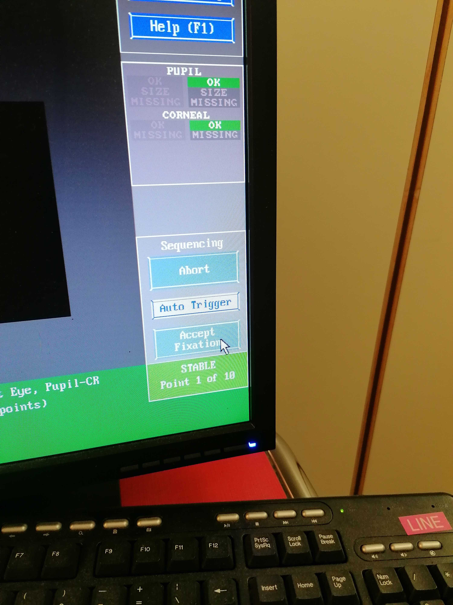

## Quick guide to the protocol settings and configuration

### Editing a sequence
- [ ] Double click on the sequence name.
- [ ] After editing the sequence, you MUST store the changes if you want them to be kept by clicking on the Go button:

    

### Setting sequences for automatic start
- [ ] You can set the worker icon on the left of the sequence by clicking on it if you want to pause before starting that sequence. If the worker is not present, the sequence will launch automatically.

    

- [ ] Blocks with a name between double underscores `__*__` introduce an *Exam Paused* break.
    Such breaks prompt a modal dialog with the *Exam Paused* title like this:

    

    !!! warning "The *Patient has Contrast Agent* checkbox MUST always be unchecked, as this protocol does not involve a contrast agent""

- [ ] Click Continue when you are ready to proceed.

### Setting the FoV
!!! warning "Using the anatomical image to adjust the field-of-view (FoV) is RECOMMENDED"

    - [ ] Drag and drop the protocol's stack icon (🗇) corresponding to the `anat-T1w__mprage` sequence into the image viewer.
        The icon will appear AFTER the image has been acquired.

- [ ] Make sure that the FOV (yellow square) includes the whole brain by tilting or translating the FOV. If the full brain, including the cerebellum, do not fit in the FOV, favorise making sure that the cortex is fully enclosed in the yellow square. For reproduciblity, it is better if the FOV across sequences have a similar center and a similar tilt. However, if it is not possible, the priority remains to include the whole brain in the FOV. 
- [ ] If two sequences have the same resolution and the same number of slices, you can copy paste the FOV
    - [ ] Open the sequence for which you want to adjust the FOV/geometry
    - [ ] Right click on the sequence for which the FOV has already been carefully positioned
    - [ ] Select `Copy Parameters`
    - [ ] `Center of slice groups and saturation regions`
- [ ] Once the FOV is well placed, store the new settings of the sequence by pressing Go.

    

## Eye-tracker calibration
- [ ] Inform the participant about the calibration process (the [scanning protocol](scanning.md) provides you with scripts)
- [ ] Run the experiment by pressing the green play button. 
- [ ] Enter the session and participant number in the pop up window. The Eyelink system setup page opens.
- [ ] Press C to open the calibration mode to perform the calibration and validation.
- [ ] Exit the calibration mode by clicking on [WHAT?].
- [ ] Once the calibration of the ET is concluded, hit the Esc key on the laptop *{{ secrets.hosts.psychopy | default("███") }}* to exit the calibration mode continue the task's program.

- [ ] Launch the ET calibration by pressing C on the laptop keyboard or by clicking on Calibration on the ET interface:
    - [ ] When the gaze is stable, the button `Accept fixation` appears green, then you can manually click on it to validate the first position.

     

    - [ ] The following positions should be validated automatically when the gase is stable enough. If it is not the case, manually click on the validate button when it turns green
- [ ] The ET software MUST show a cross during the calibration. If it does not, try sequentially the following:
    - [ ] readjust the focus of the ET; and if it still doesn't show the cross,
    - [ ] readjust the mirror frame position sliding it throught the rails attached to the coil; and if it still doesn't show the cross,
    - [ ] readjust the participant's head positioning inside the coil; and if it still doesn't show the cross,
    - [ ] move the mirror up or down (being careful as mentioned before). Just a few mm can ruin the calibration and the eye-position; and if it still doesn't show the cross,
    - [ ] iterate over the previous steps.
- [ ] When the calibration is successful, launch the validation by clicking on validation on the ET interface or clicking V on the keyboard of the laptop. Follow the same instructions as in the calibration to validate the positions.
- [ ] If the validation is not ok, iterate over previous steps restarting calibration. Otherwise, you can leave the calibration mode on and move forward.

