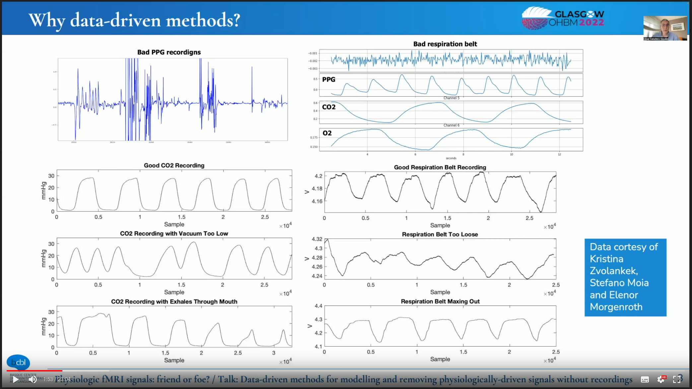
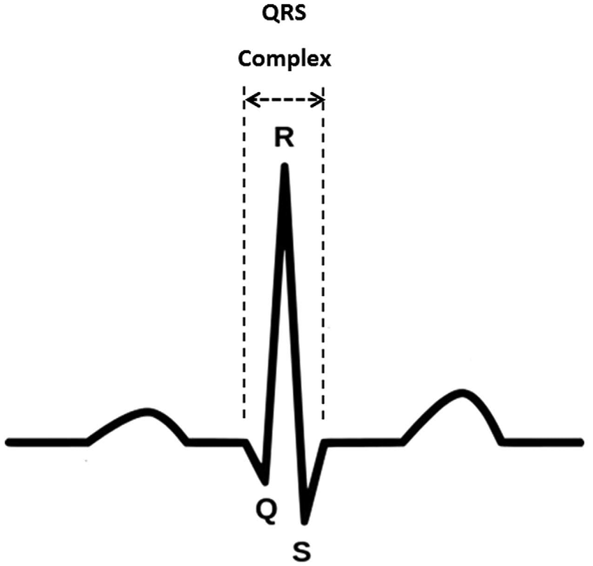
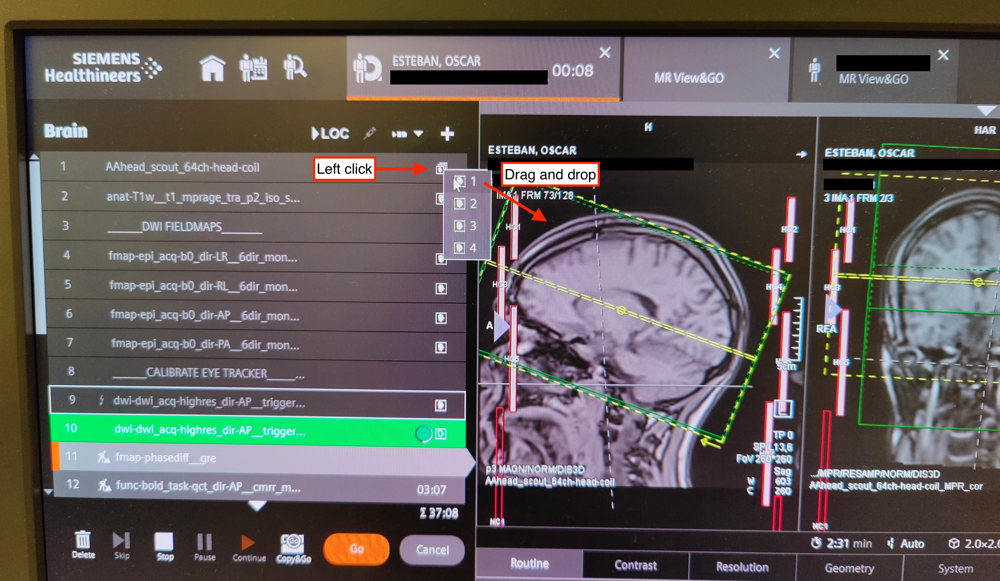

!!!danger "Familiarize with emergency procedures"
    You MUST know the security procedures in case of problem and keep yourself updated with changes.
    Some of the emergency procedures are found [here](emergency-procedures.md).

    In addition to the brief guidelines given in these SOPs, further safety information is found in {{ secrets.tribu.mri_security | default("███") }}.

## Before initiating the session

??? warning "Double check the protocol with the correct phase-encoding direction was selected"

    For conveniency, this is the session schedule (<mark>today is {{ now() }}</mark>):





!!! warning "Report all observations in the session notes"
    It is easy to forget details about particular sessions, especially when so many sessions are acquired. 
    They can however be very informative for quality control of your data or understand idiosyncrasies, so it is important to keep track of them.
    As such, please note any observation in the issue dedicated to collecting session notes that you should have opened in [the preparation of the session](pre-session.md#documentation-and-other-non-experimental-devices).

## During the session

- [ ] Check in with the participant frequently, not necessarily only at the scripted points.
- [ ] Watch for motion and arousal state using the ET's camera.
      If you detect motion or the participant falls asleep at inadequate points, use the speaker to inform them.

## Check experimental setup

!!! danger "DO NOT FORGET to check the readiness of the experimental setup at this point"

### Check the syncbox

- [ ] the box is on,
- [ ] *Synchronization mode* is on,
- [ ] session has been started,
- [ ] volume count is reset to 0 out of 9999,
- [ ] USB cable to *{{ secrets.hosts.psychopy | default("███") }}* is connected.
- [ ] Check the corresponding box in the issue collecting notes about the session.

### Check the BIOPAC

- [ ] All cables are connected and not loose or hanging.
- [ ] The BIOPAC is turned on (switch it on if necessary).
- [ ] Check the corresponding box in the issue collecting notes about the session.

### Check the GA

- [ ] **the exhaust cap IS REMOVED**
- [ ] the tubing coming from the scanning room is properly connected,
- [ ] the CO<sub>2</sub> BNC output is plugged through the filter to the BIOPAC AMI200, on input channel 3,
- [ ] the GA is on (switch it on if necessary),
- [ ] ensure **the PUMP IS ON**, and
- [ ] **turn the pump's power knob to MAXIMUM position**.
- [ ] Check the corresponding box in the issue collecting notes about the session.

### Check the eye-tracker

- [ ] The ET computer is turned on (switch it on if necessary),
- [ ] The pupil is correctly detected (as described [here](participant-prep.md#final-preparatory-steps-of-the-et))
- [ ] Check the corresponding box in the issue collecting notes about the session.

### Check *{{ secrets.hosts.psychopy | default("███") }}*:

- [ ] has enough battery, and plug the power cord if necessary;
- [ ] USB cable to the MMBT-S Trigger Interface Box is connected;
- [ ] serial cable from the MMBT-S Trigger Interface Box is connected to the back of the SPT100D digital interface (gray block) of the BIOPAC;
- [ ] computer is ready, with psychopy open, and with the appropriate version of experiments; and
- [ ] leave the computer with a pleasant screen projecting (e.g., a gray background).
- [ ] Check the corresponding box in the issue collecting notes about the session.

??? danger "Make sure to load the correct environment"

    - [ ] Deactivate conda (if active):
        ``` shell
        conda deactivate
        ```
    - [ ] Load the new virtual environment:
        ``` shell
        source $HOME/psychopyenv/bin/activate
        ```

### Check *{{ secrets.hosts.acqknowledge | default("███") }}*:

- [ ] has enough battery, and plug the power cord if necessary;
- [ ] computer is ready, with the *AcqKnowledge* software open and collecting data;
- [ ] check the ECG and RB signals, and fix unanticipated problems (e.g., the respiration belt needs to be fastened tighter);
- [ ] the *Amphetamine* app is running and keeping the computer unlocked while *AcqKnowledge* is working.
- [ ] Check the corresponding box in the issue collecting notes about the session.

!!! warning "When running multiple sessions back-to-back"

        - [ ] Restart a new session of the syncbox (within one session we usually see 9,000+, and the maximum is 9,999):
            - [ ] Press the central button :fontawesome-solid-circle:{ .bluecolor } to stop the session,
            - [ ] use the up :fontawesome-solid-caret-up:{ .bluecolor } and down :fontawesome-solid-caret-down:{ .bluecolor } arrows to find and select the option <span class="syncbox">Start Session</span> and hit enter :fontawesome-solid-circle:{ .bluecolor },
            - [ ] Press the central button :fontawesome-solid-circle:{ .bluecolor } again to start the new session.
        - [ ] In *AcqKnowledge*, make sure you stopped the previous recording and started a new one (it will ask for a re-calibration of the respiration belt).
        - [ ] Start a *New examination* on the MR console:
            - [ ] Make sure all acquisitions are done,
            - [ ] close any open patient window,
            - [ ] find the patient in the system (or write new information for a new participant)
            - [ ] right click on the patient and press `start new examination`.

## Ensuring the quality of physiological signals

It is critical to check that physiological signals are looking good:

* Before starting the session, and
* from time to time within the session.

|  |
|:--:|
| ***Examples of good and problematic RB and CO<sub>2</sub> signals.*** *Following these guidelines, our physiological signals should resemble the cases labeled as "good" above.* |

!!! thanks "Thanks to César Caballero-Gaudés, Stefano Moia, Kristina Zvolankek, Elenor Morgenroth for the slide above<sup>[1]</sup>."

### Checking the RB

!!! warning "To ensure the best RB signal"
    Calibrate the RB with the tube **unplugged** while the participant is **in** the scanner (you may have to help the participant).
    Then, ask (and/or help) the participant to plug it back.

- [ ] The RB signal SHOULD NOT plateau (neither saturate at a peak value nor floor at the troughs).
    This means the RB is maxing out and it requires loosening.
- [ ] The envelope of your signal SHOULD remain approximately constant.
    If peaks drop or troughs rise, it might be a sign that the RB is too loose.
    Go back into the scanning room and tighten the RB.
- [ ] Check the corresponding box in the issue collecting notes about the session.

### Checking the CO<sub>2</sub> signal

- [ ] The period of the CO<sub>2</sub> signal should remain constant.
    If it varies, the vacuum MAY be too low:

    - [ ] Check that the nasal cannula is correctly placed in the participant's nostrils.
    - [ ] Check that all the extension connections of the tube are air-tight
    - [ ] Check that the tube is not hanging at any point.

- [ ] The envelope of your signal SHOULD remain approximately constant.
    If the peaks diminish, it might be a sign that the participant is breathing through their mouth.
    In such a case, remind the participant to breathe through their nose.

    ???+ quote "Remind the participant they MUST breathe through their nose at all times"
        Hey [NAME],

        Is everything okay?

        I needed to ask you whether you are breathing through your nose because we are not recording sensible levels of CO<sub>2</sub>.

        [WAIT FOR THEIR RESPONSE]

        Thank you.

- [ ] Check the corresponding box in the issue collecting notes about the session.

### Checking the ECG signal

- [ ] The period and the envelope of the signal should remain constant.
- [ ] [We are placing the ECG electrodes in lead-1 mode](participant-prep.md#connecting-physiological-recording-sensors-and-probes), which should give an ECG signal that looks vaguely like the familiar QRS shape (see below).
    Typically, the signal does not look as neat as on the schema because the magnetic fields of the MR interfere with the electrodes (even if they are MR-compatible electrodes).

    {: style="height:220px;width:220px"}

- [ ] Check the corresponding box in the issue collecting notes about the session.

---

## Acquire a localizer (*AAhead_scout*)
- [ ] Indicate the participant that the scanning will soon start:

    ???+ quote "Tell the participant that we are starting"
        Hey [NAME], we are about to start our first scan run.

        This is going to be a long session, so please make sure you are feeling as comfortable as you possibly can in there.
        Remember not to cross your legs or hold your hands together and check your back is also comfortable.
        I'm going to ask you to take a deep breath now, so I can check the respiration belt is properly set up.
        If it is too tight, please let me know.

        [Allow a few moments for the participant to breathe while you check the recordings]

        Okay, we seem to be able to track your respiration. Is the respiration belt too restraining?
        This is also a good moment to swallow, and to check your neck and head are in a comfortable position.

        For this first part, all you have to do is stay still; you can relax and close your eyes if it helps.

        Are you ready?

- [ ] Wait for the participant confirmation and set the speaker off afterward.
- [ ] Launch the `AAhead_scout_64ch-head-coil` protocol by pressing *Continue* :fontawesome-solid-play:{ .redcolor }.

**Once the localizer is concluded:**

- [ ] Click on the image stack icon (something like 🗇, with an object on the top stack) and drag the image with a **1** onto the image viewer.
    That will open the **interpolated** localizer on the viewer.

    

- [ ] In the issue collecting notes about the session, check the box confirming that the localizer has been acquired. 
    - [ ] If the quality looks good, check the box stating `Localizer looked ok`. If not, follow the paragraph below.

### If the localizer presents very low quality

!!! warning "The localizer may present very low quality if the head-coil has not been properly initiated by the scanner"

- [ ] In the issue collecting notes about the session, specifically under *anat* issues select the problem and describe it in detail in the anatomical scan notes section. 
- [ ] Enter the scanning room, extract the participant from the scanner by pressing the home (:fontawesome-solid-house:) button.
- [ ] Tell the participant that you need to reset the head coil
- [ ] Unplug and replug the head coil
- [ ] Check that the coil has been properly detected in the scanner's monitor
- [ ] Re-insert the participant in the scanner
- [ ] Re-run the `AAhead_scout_{32,64}ch-head-coil` protocol.

## Acquire a high-resolution, anatomical image

- [ ] Launch the `anat-T1w__mprage` protocol by pressing *Continue* :fontawesome-solid-play:{ .redcolor }.

    !!! warning "While you are still running the MPRAGE sequence"
        - [ ] Open the parameters of the sequence named `fmap-phasediff__gre` and ensure that under *Contrast* ⤷ *Reconstruction* the option *Magnitude et phase* is selected. This is crucial so that both the magnitude and the phase difference field map images are saved.
        - [ ] Repeat the configuration of *Magnitude et phase* for all sequences name `fmap-epi_acq-bold_dir-{RL,LR,PA,AP}__*`.
        - [ ] Repeat the configuration of *Magnitude et phase* for all sequences name `func-bold_task-{bht,qct,rest}_dir-{RL,LR,PA,AP}__cmrr_me4_sms4`.
        - [ ] Open the `dwi-dwi_dir-{RL,LR,PA,AP}__279dir_monopolar` sequence and under the section *Diff.*, uncheck all the derivatives except for *Diff. Weighted Image*.
        - [ ] Open the `fmap-epi_acq-b0_dir-{RL,LR,PA,AP}__*` sequences and under the section *Diff.*, uncheck all the derivatives except for *Diff. Weighted Image*.

- [ ] In the issue collecting notes about the session, check the box confirming that the T1w image has been acquired. 
    - [ ] If the quality looks good, check the box stating `T1w looked okay`.
        If not, please follow [the instructions to repeat the scan](scanning-notes.md#repeat-scan) and report the problem in the session notes.

## Acquire the dMRI EPI fieldmaps

- [ ] [Adjust the FoV](scanning-notes.md#setting-the-fov) of the `fmap-epi_acq-b0_dir-{RL,LR,PA,AP}__6dir_monopolar*` sequences.
- [ ] Verify again the `fmap-epi_acq-b0_dir-{RL,LR,PA,AP}__6dir_monopolar` parameters under section *Diff.* All the derivatives MUST be unchecked except for *Diff. Weighted Image*.
- [ ] Inform the participant that the diffusion scan will follow.

    ??? quote "Only for the participant of Cohort I"

        Hey Oscar, we are ready to proceed with the diffusion scan.
        The BIOPAC is functional and *AcqKnowledge* is properly registering the respiration belt and ECG.
        The gas analyzer is ON, but it is still warming up.
        The psychopy computer is ready.
        Are you ready?

    ???+ quote "Participant of Cohort II"

        Hey [NAME], the next block is a bit long.
        First, we will run four short sequences of less than one minute and then a long block of around 30 minutes.

        You can close your eyes and even sleep if you wish.

        I'm going to give you a short time (ten seconds or so) to swallow, and perhaps accommodate your back or your arms. However, please try not to move your head.

        It is critical that you don't move, especially at all at the very beginning and the next 20 seconds after you hear the first blipping sounds.

        Try to minimize swallowing and eye movements (for example, blinking) and maintain comfortable and shallow breathing.
        Remember to breathe through your nose, not through your mouth, so the expired CO<sub>2</sub> can be measured with the cannula.

        Are you ready?

- [ ] Launch the DWI-EPI sequence `fmap-epi_acq-b0_dir-{RL,LR,PA,AP}__6dir_monopolar` for *B<sub>0</sub>* field mapping by pressing *Continue* :fontawesome-solid-play:{ .redcolor }.

**While the fieldmaps are running:**

- [ ] [adjust the FoV](scanning-notes.md#setting-the-fov) of the `dwi-dwi_dir-{RL,LR,PA,AP}__279dir_monopolar` sequence, and
- [ ] prepare the execution of the fixation program on the stimuli laptop (*{{ secrets.hosts.psychopy | default("███") }}*), which will be played during the DWI by typing the following on a terminal:

    ??? warning "Make sure to have the correct environment loaded before invoking the task"

        - [ ] Deactivate conda (if active):
            ``` shell
            conda deactivate
            ```
        - [ ] Load the new virtual environment:
            ``` shell
            source $HOME/psychopyenv/bin/activate
            ```

    ``` shell
    cd ~/workspace/HCPh-fMRI-tasks
    python {{ settings.psychopy.tasks.dwi }}.py
    ```

    A modal dialog will ask you for the number of trial (automatically calculated, DO NOT modify) and the session number.

    !!! danger "The following two steps MUST be executed in this order"

            - [ ] Drag and drop the modal dialog into the scanner's projector screen.
            - [ ] Update the session number with the corresponding number.

!!! important "At this point, the GA should have finished the warm-up so you can verify it is working"

    - [ ] Ask the participant to take three deep breathes, to then go back to a comfortable, normal respiration pace.
    - [ ] Check on the *AcqKnoledge* window that the three breathes are distinctly registered (taking into account that there may be 10-25 seconds of delay because of the tubing).

## Acquire the diffusion MRI run

- [ ] Verify again the `dwi-dwi_dir-{RL,LR,PA,AP}__279dir_monopolar` parameters under section *Diff.* All the derivatives MUST be unchecked except for *Diff. Weighted Image*.
- [ ] Inform the participant that before the long dMRI block, the ET must be calibrated.

    ???+ quote "Starting the dMRI block after calibrating the eye tracker"

        Hey [NAME], is everything alright thus far?

        [Allow some time for response]

        Before we start the long dMRI block, we need to calibrate the eye-tracker device, which follows your right eye during experiments.

        Your are going to see a round fixation point, and the point is going to move randomly over the screen space.
        Please follow it with your gaze, trying to look at it as stable as possible and without moving your head.

        Are you ready?

- [ ] On the stimuli laptop (*{{ secrets.hosts.psychopy | default("███") }}*), check the correct session number is set and hit *OK*.

    ??? danger "The OK button MUST be clicked with this modal dialog on the projector's screen"

        Otherwise, the wrong screen will be selected by *Psychopy*

- [ ] Proceed with [the ET calibration](scanning-notes.md#eye-tracker-calibration).
    **The ET control menu will appear after hitting *OK* on the modal dialog**.
- [ ] Launch the diffusion `dwi-dwi_dir-{RL,LR,PA,AP}__279dir_monopolar` sequence by pressing *Continue* :fontawesome-solid-play:{ .redcolor }.

**While the dMRI is running:**

- [ ] [Adjust the FoV](scanning-notes.md#setting-the-fov) for the following sequence (GRE fieldmap).

**When the dMRI concludes:**

- [ ] Wait for the current task program to finish on *{{ secrets.hosts.psychopy | default("███") }}*.

    !!! warning "If you must interrupt the task program, check first that the EDF files have been copied."

## Acquire the GRE fieldmap
- [ ] In the corresponding issue for the collection of notes about the session, check the box confirming that the diffusion sequence has been acquired.
    Don't forget to report any observations there.
- [ ] Launch the GRE (*phase difference*) sequence `fmap-phasediff__gre` for *B<sub>0</sub>* field mapping by pressing *Continue* :fontawesome-solid-play:{ .redcolor }.

**While the GRE fieldmap is running:**

- [ ] [Adjust the FoV](scanning-notes.md#setting-the-fov) for the positive-control-task (`func-bold_task-qct_dir-{RL,LR,PA,AP}__cmrr_me4_sms4`) fMRI sequence,
- [ ] verify that in the next sequence parameters under *Contrast>Reconstruction* the option *Magnitude et phase* is selected,
- [ ] verify the *Number of measurements* with respect to the [task's timing](intro.md#task-timing) ({{ settings.mri.timings.func_qct }}),
- [ ] verify that the EDF file with the ET recordings corresponding to the dMRI have been stored, and
- [ ] prepare the execution of the QCT by executing the following on a terminal:

    ??? warning "Make sure to have the correct environment loaded before invoking the task"

        - [ ] Deactivate conda (if active):
            ``` shell
            conda deactivate
            ```
        - [ ] Load the new virtual environment:
            ``` shell
            source $HOME/psychopyenv/bin/activate
            ```

    ``` shell
    cd ~/workspace/HCPh-fMRI-tasks
    python {{ settings.psychopy.tasks.func_qct }}.py
    ```

    A modal dialog will ask you for the number of trial (automatically calculated, DO NOT modify) and the session number.

    !!! danger "The following two steps MUST be executed in this order"

            - [ ] Drag and drop the modal dialog into the scanner's projector screen.
            - [ ] Update the session number with the corresponding number.


- [ ] In the issue collecting notes about the session, check the boxes confirming that each fieldmap has been acquired and that you check that the physiological signal are still recording.
    Don't forget to report any observations there.

## Acquire the functional MRI block

- [ ] Inform the participant about the fMRI block

    ???+ quote "Starting the fMRI block"
        Hey [NAME], we are now to move into measuring the activity of your brain.

        Is everything alright thus far?

        [Allow some time for response]

        Before we start, we are going to check if the eye-tracker is still accurate.

        Your are going to see a fixed, round fixation point.
        Please focus your gaze on it, trying to look at it as stable as possible and without moving your head.

        If the eye-tracker is very off, we will re-calibrate it.

        Are you ready?

- [ ] Wait for confirmation, respond to follow-up comments.
- [ ] On the stimuli laptop (*{{ secrets.hosts.psychopy | default("███") }}*), check the correct session number is set and hit *OK*.

    ??? danger "The OK button MUST be clicked with this modal dialog on the projector's screen"

        Otherwise, the wrong screen will be selected by *Psychopy*

- [ ] [Initiate the ET drift correction procedure](scanning-notes.md#eye-tracker-drift).
    **The ET control menu will appear after hitting *OK* on the modal dialog**.

### Quality-control task (QCT)
- [ ] Verify that the task's program is awaiting the scanner's trigger to start.
- [ ] Inform the participant that we will proceed with the quality-control task (QCT). Repeat task instructions.

    ???+ quote "Starting the positive control task"
        Hey [NAME], thanks for your collaboration with the eye tracking calibration.

        The following block will collect some behavioral data and requires your collaboration.
        You will be exposed to several activities.

        Whenever you see a red circle, please fix your gaze on it, wherever it is shown on the screen.
        If the red circle moves, we ask you to follow it with your eyes.

        Some other times, you'll see either "RIGHT" or "LEFT" written on the screen. During those times, please tap your thumb and the other fingers of your right or left hand as indicated on the screen.

        Before we start, please leave the alarm button on your tummy to free your hand for finger tapping. Please do not hesitate to grab it in case you need to squeeze it.

- [ ] Launch the `func-bold_task-qct_dir-{RL,LR,PA,AP}__cmrr_me4_sms4` protocol by pressing *Continue* :fontawesome-solid-play:{ .redcolor }.
- [ ] Confirm that the task program starts on *{{ secrets.hosts.psychopy | default("███") }}* after the calibration scans.

**While the QCT is running:**

- [ ] [Adjust the FoV](scanning-notes.md#setting-the-fov) for the following sequence,
- [ ] double check that it has the setting *Magnitude et phase* selected in the drop-down menu under *Contrast>Reconstruction*.

**Once the QCT has concluded:**

- [ ] Wait for the current task program to finish on *{{ secrets.hosts.psychopy | default("███") }}*.

    !!! warning "If you must interrupt the task program, check first that the EDF files have been copied."

- [ ] In the corresponding issue for the collection of notes about the session, check the box confirming that the quality control task fMRI has been acquired and that you check that the physiological signals are still being recorded.
    Don't forget to report any observations there.

### BOLD fieldmaps
- [ ] Launch the BOLD-EPI sequence `fmap-epi_acq-bold_dir-{RL,LR,PA,AP}__cmrr_me4_sms4` for *B<sub>0</sub>* field mapping by pressing *Continue* :fontawesome-solid-play:{ .redcolor }.

**While the BOLD fieldmaps are running:**

- [ ] [Adjust the FoV](scanning-notes.md#setting-the-fov) for the following sequence,
- [ ] verify the *Number of measurements* with respect to the [task's timing](intro.md#task-timing) ({{ settings.mri.timings.func_rest }}), and
- [ ] double check that it has the setting *Magnitude et phase* selected in the drop-down menu under *Contrast>Reconstruction*.

!!! important "Do not attempt to initiate the next task program before fieldmaps conclude"

    The BOLD fieldmaps will be sending trigger pulses that will make the process almost impossible.

**Once the BOLD fieldmaps are concluded:**

- [ ] Prepare the execution of the RSfMRI by executing the following on a terminal:

    ??? warning "Make sure to have the correct environment loaded before invoking the task"

        - [ ] Deactivate conda (if active):
            ``` shell
            conda deactivate
            ```
        - [ ] Load the new virtual environment:
            ``` shell
            source $HOME/psychopyenv/bin/activate
            ```

    ``` shell
    cd ~/workspace/HCPh-fMRI-tasks
    python {{ settings.psychopy.tasks.func_rest }}.py
    ```

    A modal dialog will ask you for the number of trial (automatically calculated, DO NOT modify) and the session number.

    !!! danger "The following steps MUST be executed in this order"

            - [ ] Drag and drop the modal dialog into the scanner's projector screen.
            - [ ] Update the session number with the corresponding number.

- [ ] On the stimuli laptop (*{{ secrets.hosts.psychopy | default("███") }}*), check the correct session number is set and hit *OK*.

    ??? danger "The OK button MUST be clicked with this modal dialog on the projector's screen"

        Otherwise, the wrong screen will be selected by *Psychopy*

### Resting state fMRI
- [ ] Inform the participant:

    ???+ quote "Drift-check ET before continuing"
        Thanks [NAME], that was a short behavioral task.

        Before moving on, we will run another check of the eye tracker, please focus your sight on the fixation point.

        Is everything alright?

- [ ] Wait for confirmation, respond to follow-up comments
- [ ] [Initiate the ET drift correction procedure](scanning-notes.md#eye-tracker-drift).
    **The ET control menu must have appeared after hitting *OK* on the modal dialog**.
    - [ ] Once the ET is calibrated, verify that the task is left and awaiting for the sequence's trigger to start.
- [ ] Inform the participant that the next sequence is resting-state fMRI (RSfMRI).

    ???+ quote "Starting the resting-state block"
        Hey [NAME], we are about to start resting-state fMRI.

        For this scan, all you have to do is stay still, and look at the movie.
        Please do not close your eyes, and it is particularly critical that you don't move at all in the initial moments of the acquisition block.

        Are you ready?

- [ ] Launch the RSfMRI sequence `func-bold_task-rest_dir-{RL,LR,PA,AP}__cmrr_me4_sms4` by pressing *Continue* :fontawesome-solid-play:{ .redcolor }.
- [ ] Confirm that the task program starts on *{{ secrets.hosts.psychopy | default("███") }}* after the calibration scans.

**While the RSfMRI is running**:

- [ ] [Adjust the FoV](scanning-notes.md#setting-the-fov) for the following sequence,
- [ ] verify the *Number of measurements* with respect to the [task's timing](intro.md#task-timing) ({{ settings.mri.timings.func_bht }}), and
- [ ] double check that it has the setting *Magnitude et phase* selected in the drop-down menu under *Contrast>Reconstruction*.

**Once the RSfMRI is concluded:**

- [ ] Wait for the current task program to finish on *{{ secrets.hosts.psychopy | default("███") }}*.

    !!! warning "If you must interrupt the task program, check first that the EDF files have been copied."

- [ ] In the corresponding issue for the collection of notes about the session, check the box confirming that the quality control task fMRI has been acquired and that you check that the physiological signals are still being recorded.
    Don't forget to report any observations there.
- [ ] Prepare the execution of the BHT by executing the following on a terminal:

    ??? warning "Make sure to have the correct environment loaded before invoking the task"

        - [ ] Deactivate conda (if active):
            ``` shell
            conda deactivate
            ```
        - [ ] Load the new virtual environment:
            ``` shell
            source $HOME/psychopyenv/bin/activate
            ```

    ``` shell
    cd ~/workspace/HCPh-fMRI-tasks
    python {{ settings.psychopy.tasks.func_bht }}.py
    ```

    A modal dialog will ask you for the number of trial (automatically calculated, DO NOT modify) and the session number.

    !!! danger "The following steps MUST be executed in this order"

            - [ ] Drag and drop the modal dialog into the scanner's projector screen.
            - [ ] Update the session number with the corresponding number.

- [ ] On the stimuli laptop (*{{ secrets.hosts.psychopy | default("███") }}*), check the correct session number is set and hit *OK*.

    ??? danger "The OK button MUST be clicked with this modal dialog on the projector's screen"

        Otherwise, the wrong screen will be selected by *Psychopy*

### Breath-holding task (BHT)
- [ ] Inform the participant:

    ???+ quote "Drift-check ET before continuing"
        Thanks [NAME], that was a long behavioral task.

        Before moving on, we will run another check of the eye tracker, please focus your sight on the fixation point.

        Is everything alright?

- [ ] Wait for confirmation, respond to follow-up comments
- [ ] [Initiate the ET drift correction procedure](scanning-notes.md#eye-tracker-drift).
    **The ET control menu must have appeared after hitting *OK* on the modal dialog**.
    - [ ] Once the ET is *drift-checked* and no calibration is needed, verify that the ET menu is removed and the task program awaits for the sequence's trigger to start.
- [ ] Inform the participant that the next sequence is breath-holding task fMRI.
    Repeat the instructions for the task.

    ???+ quote "Starting the breath-holding task"
        Hey [NAME], we will proceed now with a breath-holding task.

        I remind you that you have to breathe following the cues of the colored rectangle.

        Green means "BREATHE IN", orange means "BREATHE OUT" and red means "HOLD YOUR BREATH".

        Remember to not follow the breathing instructions during the first block and to exhale the small amount of air you have remaining at the end of the hold.

        Are you ready?

- [ ] Launch the `func-bold_task-bht_dir-{RL,LR,PA,AP}__cmrr_me4_sms4` sequence by pressing *Continue* :fontawesome-solid-play:{ .redcolor }.
- [ ] Confirm that the task program starts on *{{ secrets.hosts.psychopy | default("███") }}* after the calibration scans.

**While the BHT is running:**

- [ ] Determine whether there is enough time to run the anatomical T2-weighted run.
    If so,
    - [ ] [adjust the FoV](scanning-notes.md#setting-the-fov) for the following sequence; or alternatively
    - [ ] wait for the sequence to complete.

**Once the BHT is concluded:**

- [ ] Wait for the current task program to finish on *{{ secrets.hosts.psychopy | default("███") }}*.

    !!! warning "If you must interrupt the task program, check first that the EDF files have been copied."

- [ ] Check the box confirming that it has been acquired in the issue collecting notes about the session.
    Don't forget to report any observations there.


## Acquire a T2w image (if time permits)

- [ ] Launch the `anat-T2w__flair` protocol by pressing *Continue* :fontawesome-solid-play:{ .redcolor }, or
- [ ] skip the T<sub>2</sub>-weighted collection.

## Stop physiology collection

!!! warning "The following step MAY be done while the T2w is running."

- [ ] Stop the *AcqKnowledge* recording on the *{{ secrets.hosts.acqknowledge | default("███") }}* computer.

!!! tip "The following steps MAY be done while the T2w is running IF (and only if) there's no back-to-back session upon conclusion of the current"

    - [ ] Switch the BIOPAC MP160 module off.
    - [ ] Turn off the pump of the GA.
    - [ ] Switch the GA off.
    - [ ] Put the exhaust and inlet caps back.

## Concluding the session

- [ ] Inform the participant:

    ???+ quote "Session is finished"
        Thanks [NAME], the session has concluded and we will shortly let you out of the scanner.

---

## Session completed

The exam is over, you can proceed with the [tear-down protocol](./tear-down.md).

---

[1]: https://www.humanbrainmapping.org/i4a/pages/index.cfm?pageid=4055 "Moia, Stefano, Molly Bright, D. Phil., and Cesar Caballero-Gaudes. “Physiologic fMRI Signals: Friend or Foe? How and Why to Measure, Model and Account for Physiology.” Presented at the Organization for Human Brain Mapping (OHBM), Glasgow, June 19, 2022."
