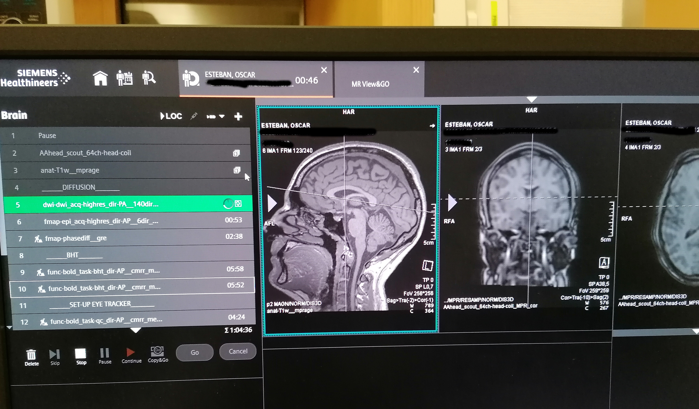

!!!danger "BE REACTIVE in case the alarm rings"
    If at any point the participant rings the alarm, it is crucial to check on the participant IMMEDIATELY.

    - [ ] Ask through the speaker if everything is alright because it might be that the participant pressed the alarm by mistake.
    - [ ] If you do not get a clear answer that everything is ok, enter the scanning room 
    - [ ] Only then turn off the alarm using the circular button either on the left or on the right of the bore.
        
    - [ ] Ask to the participant what's wrong. 
        - [ ] If he needs reassurance or information, provide it and confirm he can continue the scanning session. However, if you cannot communicate efficiently, take the participant out of the scanner.
        - [ ] If the participant does not feel well, provide assistance or call [WHO?] if it is really serious or if you have any doubts.

- [ ] Indicate the participant that the scanning will soon start:

    > Hey [NAME], we are about to start our first scan run.
    > For this scan, all you have to do is stay still; you can relax and close your eyes if it helps.
    > Are you ready?

- [ ] Start Exam
- [ ] Launch the AAhead_scout by pressing `Continue`.

- [ ] Once the scout is finished, you can drag the corresponding images (four superposed squares next to the sequence name that correspond to the images actually acquired in a sagittal view, and the interpolated images in the strict coronal, sagittal and transverse planes) to the MR image viewer to check their quality. A localizer of bad quality will present noise in the background. If the localizer is not ok, unplug and replug the head coil and reacquire the AAhead_scout sequence.

- [ ] Launch the T1-weighted MPRAGE sequence by pressing `Go`.
- [ ] While you run the MPRAGE sequence, there are a few important points to address:

    !!!warning "Important"
        - [ ] Open the parameters of the sequence named "fmap-phasediff__gre" and ensure that under Contrast>Reconstruction the option "Magnitude et phase" is selected. This is crucial so that both the magnitude and the phase difference field map images are saved.
        - [ ] Repeat the latter for the sequence name "fmap-epi_dir-XX".
        - [ ] Open the DWI sequence and under the section `Diff.`, uncheck all the derivatives except `Diff. Weighted Image`.

!!!note "Essentials for running an MRI session"
    Once the T1-weighted sequence is finished, you can drag the corresponding high-resolution images to the MR image viewer. This will allow to position the field-of-view (FOV) for the DWI and BOLD sequences more accurately than the initial scout.
        
    - [ ] Open the next sequence by double clicking on it.
    - [ ] Make sure that the FOV (yellow square) includes the whole brain by tilting or translating the FOV. If the full brain, including the cerebellum, do not fit in the FOV, favorise making sure that the cortex is fully enclosed in the yellow square. For reproduciblity, it is better if the FOV across sequences have a similar center and a similar tilt. However, if it is not possible, the priority remains to include the whole brain in the FOV. 
    - [ ] If two sequences have the same resolution and the same number of slices, you can copy paste the FOV
        - [ ] Open the sequence for which you want to adjust the FOV/geometry
        - [ ] Right click on the sequence for which the FOV has already been carefully positioned
        - [ ] Select `Copy Parameters`
        - [ ] `Center of slice groups and saturation regions`
    - [ ] Once the FOV is well placed, launch the sequence by pressing `Go`.

    

    - [ ] You can set the worker icon on the left of the sequence by clicking on it if you want to pause before starting that sequence. If the worker is not present, the sequence will launch automatically.

        

        - [ ] Note that the bloc with `__x__` introduces a break.
            The scanner will warn you that *Exam Paused*. Click `Continue`.
            The `Patient has Contrast Agent` checkbox MUST always be unchecked, as this protocol does not involve a contrast agent.

        

    - [ ] Check in with the participant frequently.
    - [ ] Watch for motion if you can see the participant, or use motion monitoring equipment.

- [ ] Launch the fieldmap `fmap-epi_dir-PA` sequence.
- [ ] While the fieldmap sequence is running,
    - [ ] check the FOV for the resting-state functional MRI (rsfMRI) sequence following the steps explained above.
    - [ ] Verify that the resting-state task `resting_state.psyexp` is open in psychopy, that you calibrated the ET and that the task is ready to receive the scanner trigger to start. 
- [ ] Inform the participant that the next sequence is rsfMRI.

    > Hey [NAME], we are about to start resting-state fMRI.
    > For this scan, all you have to do is stay still, and look at the movie.
    > Please do not close your eyes.
    > Are you ready?

- [ ] Launch the rsfMRI `func-bold_task-rest_dir-AP` sequence.
- [ ] While it is running, tweak the FoV for the following sequence.
- [ ] Once the sequence is over, close the resting-state task and open the breath-holding one `breath_holding_task.psyexp`.
    - [ ] Run the experiment by pressing the green play button. 
    - [ ] Enter the session and participant number in the pop up window. The Eyelink system setup page opens.
    - [ ] [DO WE HAVE TO DO THE CALIBRATION EVERYTIME OR NOT?]
    - [ ] Verify that the task is ready to receive input trigger to start.

- [ ] Inform the participant that the next sequence is breath-holding task fMRI. Repeat the instructions for the task.

    > Hey [NAME], we will proceed with the breath holding task.
    > I remind you that you have to breath following the rectangle color.
    > Green means inhale, orange means exhale and red means hold.
    > Remember to not follow the breathing instructions during the first block and to exhale the small amount of air you have remaining at the end of the hold.
    > Are you ready?

- [ ] Launch the `func-bold_task-bht_dir-AP` sequence.
- [ ] While it is running, 
    - [ ] Adjust the FoV for the next sequence.
    - [ ] Verify that in the next sequence parameters under Contrast>Reconstruction the option `Magnitude et phase` is selected!
- [ ] Once the sequence is over, you need to stop manually the psychopy task by clicking on `t` (as fast as possible to avoid collecting more data than needed).
- [ ] Launch the fieldmap `fmap_phasediff_gre` sequence.
- [ ] While it is running, 
    - [ ] Tweek the FOV for the next sequence.
    - [ ] Verify that in the next sequence parameters under [WHERE?] that all the derivatives are unchecked except `Diffusion weighted image`.
- [ ] Inform the participant that the diffusion scan will follow.

    > Hey [NAME], the next sequence is diffusion. You can close your eyes if you want and just relax.
    > It will last XX minutes.

- [ ] Launch the diffusion `dwi-dwi_dir-PA` sequence.
- [ ] While it is running, tweek the FOV for the next sequence.
- [ ] Launch the fieldmap `fmap-epi_acq-highres_dir-AP` sequence.
- [ ] While it is running, 
    - [ ] Tweek the FOV for the next sequence.
    - [ ] Prepare the the quality control task 
        - [ ] Open `control_task.psyexp` in psychopy
        - [ ] Run the experiment by pressing the green play button. 
        - [ ] Enter the session and participant number in the pop up window. The Eyelink system setup page opens.
        - [ ] [DO WE HAVE TO DO THE CALIBRATION EVERYTIME OR NOT?]
        - [ ] Verify that the task is ready to receive input trigger to start.
- [ ] Inform the participant that we will proceed with the quality control task. Repeat task instructions.

    > Hey [NAME], the next scan is the quality control task.
    > I remind you that this task is composed of different subtasks.
    > In the first subtask, you must fix the cross.
    > In the second subtask, you must follow the points with your eyes. 
    > In the third subtask, tap the finger of your left or right hand depending on the word that flashes.
    > I remind you that during the finger tapping you MUST leave the alarm button, e.g., on your belly.

- [ ] Launch the control task fMRI `func-bold_task-qc_dir-AP` sequence.
- [ ] While it is running, tweek the FOV for the next sequence.
- [ ] [SINGLE_ECHO BOLD ?]
- [ ] Launch the T2w sequence.
- [ ] The exam is over, you can proceed with the [tear-down protocol](./tear-down.md).
