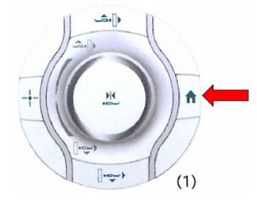
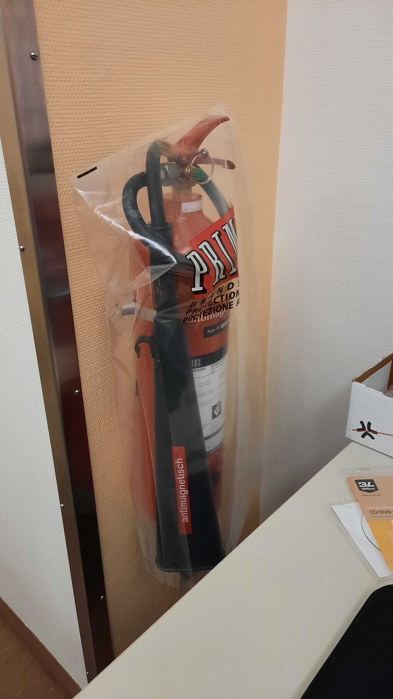

!!!danger "Be familiar with emergency procedures"
    Be sure to remember the security procedures in case of problem. They can be found [here](#emergency-procedures).

- [ ] Indicate the participant that the scanning will soon start:

    > Hey [NAME], we are about to start our first scan run.
    > For this scan, all you have to do is stay still; you can relax and close your eyes if it helps.
    > Are you ready?

- [ ] Start Exam
- [ ] Launch the AAhead_scout by pressing `Continue`.

- [ ] Once the scout is finished, you can drag the corresponding images (four superposed squares next to the sequence name that correspond to the images actually acquired in a sagittal view, and the interpolated images in the strict coronal, sagittal and transverse planes) to the MR image viewer to check their quality. A localizer of bad quality will present noise in the background. If the localizer is not ok, unplug and replug the head coil and reacquire the AAhead_scout sequence.

- [ ] Launch the T1-weighted MPRAGE sequence by pressing `Go`.
- [ ] While you run the MPRAGE sequence, there are a few important points to address:

    !!!warning "Important"
        - [ ] Open the parameters of the sequence named "fmap-phasediff__gre" and ensure that under Contrast>Reconstruction the option "Magnitude et phase" is selected. This is crucial so that both the magnitude and the phase difference field map images are saved.
        - [ ] Repeat the latter for the sequence name "fmap-epi_dir-XX".
        - [ ] Open the DWI sequence and under the section `Diff.`, uncheck all the derivatives except `Diff. Weighted Image`.

!!!note "Essentials for running an MRI session"
    Once the T1-weighted sequence is finished, you can drag the corresponding high-resolution images to the MR image viewer. This will allow to position the field-of-view (FOV) for the DWI and BOLD sequences more accurately than the initial scout.
        
    - [ ] Open the next sequence by double clicking on it.
    - [ ] Make sure that the FOV (yellow square) includes the whole brain by tilting or translating the FOV. If the full brain, including the cerebellum, do not fit in the FOV, favorise making sure that the cortex is fully enclosed in the yellow square. For reproduciblity, it is better if the FOV across sequences have a similar center and a similar tilt. However, if it is not possible, the priority remains to include the whole brain in the FOV. 
    - [ ] If two sequences have the same resolution and the same number of slices, you can copy paste the FOV
        - [ ] Open the sequence for which you want to adjust the FOV/geometry
        - [ ] Right click on the sequence for which the FOV has already been carefully positioned
        - [ ] Select `Copy Parameters`
        - [ ] `Center of slice groups and saturation regions`
    - [ ] Once the FOV is well placed, launch the sequence by pressing `Go`.

    

    - [ ] You can set the worker icon on the left of the sequence by clicking on it if you want to pause before starting that sequence. If the worker is not present, the sequence will launch automatically.

        

        - [ ] Note that the bloc with `__x__` introduces a break.
            The scanner will warn you that *Exam Paused*. Click `Continue`.
            The `Patient has Contrast Agent` checkbox MUST always be unchecked, as this protocol does not involve a contrast agent.

        

    - [ ] Check in with the participant frequently.
    - [ ] Watch for motion if you can see the participant, or use motion monitoring equipment.

- [ ] Inform the participant that the diffusion scan will follow.

    > Hey [NAME], the next block is a bit long, around 30 minutes.
    > You can close your eyes and even sleep if you wish.
    > I'm going to give you a short time (ten seconds or so) to swallow, and perhaps accommodate your back or your arms. However, please try not to move your head.
    > It is critical that you don't move, especially at all at the very beginning and the next 20 seconds after you hear the first blipping sounds.
    > Try to minimize swallowing, and eye movements (for example, blinking) and try to maintain comfortable and shallow breathing.

- [ ] Verify in the next sequence parameters under section `Diff.` that all the derivatives are unchecked except `Diff. Weighted Image`.
- [ ] Launch the diffusion `dwi-dwi_dir-XX` sequence.
- [ ] While it is running, adjust the FOV for the following sequence.
- [ ] Launch the DWI B0 fieldmapping sequence `fmap-epi_acq-highres_dir-XX`.
- [ ] While it is running, adjust the FOV for the following sequence.
- [ ] Launch the fieldmap GRE B0 fieldmapping sequence `fmap_phasediff_gre`.
- [ ] While it is running, 
    - [ ] Adjust the FOV for the following sequence.
    - [ ] Verify that in the next sequence parameters under Contrast>Reconstruction the option `Magnitude et phase` is selected!
- [ ] Launch the EPI BOLD B0 fieldmapping sequence `fmap-epi_dir-PA`. 
- [ ] While the fieldmap sequence is running,
    - [ ] check the FOV for the quality-control-task (`task-qct`) fMRI sequence following the abovementioned steps.
    - [ ] Verify that the quality-control task `control_task.psyexp` is open in psychopy, that you calibrated the ET.
- [ ] Once the calibration of the ET is concluded, hit the `Esc` key on the laptop *{{ secrets.hosts.psychopy | default("███") }}* to exit the calibration mode continue the task's program.
- [ ] Verify that the task's program is awaiting the scanner's trigger to start.
- [ ] Inform the participant that we will proceed with the quality control task. Repeat task instructions.

    > Hey [NAME], the following block will collect some behavioral data and requires your collaboration.
    > You will be exposed to several activities.
    > Whenever you see a red circle, please fix your gaze on it, wherever it is shown on the screen.
    > If the red circle moves, we ask you to follow it with your eyes.
    > Some other times, you'll see either "RIGHT" or "LEFT" written on the screen. During those times, please tap your thumb and the other fingers of your right or left hand as indicated on the screen.
    > Before we start, please leave the alarm button on your tummy to free your hand for finger tapping. Please do not hesitate to grab it in case you need to squeeze it.

- [ ] Launch the QCT (`func-bold_task-qct_dir-XX`).
- [ ] While it is running, adjust the FoV for the following sequence.
- [ ] Once the sequence is over, you need to stop manually the psychopy task by clicking on `t` (as fast as possible to avoid collecting more data than needed).
- [ ] Prepare the resting-state task.
        - [ ] Open `resting_state.psyexp` in psychopy.
        - [ ] Run the experiment by pressing the green play button. 
        - [ ] Enter the session and participant number in the pop up window. The Eyelink system setup page opens.
        - [ ] Press `C` to open the calibration mode and proceed as described in [the participant setup page](./participant-prep.md) to perform the calibration and validation.
        - [ ] Exit the calibration mode by clicking on [WHAT?].
        - [ ] Verify that the task is ready to receive input trigger to start.
- [ ] Inform the participant that the next sequence is resting-state fMRI (rsfMRI).

    > Hey [NAME], we are about to start resting-state fMRI.
    > For this scan, all you have to do is stay still, and look at the movie.
    > Please do not close your eyes.
    > Are you ready?

- [ ] Launch the rsfMRI sequence `func-bold_task-rest_dir-XX`.
- [ ] While it is running, tweak the FoV for the following sequence.
- [ ] Once the sequence is over, close the resting-state task and open the breath-holding one `breath_holding_task.psyexp`.
    - [ ] Run the experiment by pressing the green play button. 
    - [ ] Enter the session and participant number in the pop up window. The Eyelink system setup page opens.
    - [ ] Press `C` to open the calibration mode and proceed as described in [the participant setup page](./participant-prep.md) to perform the calibration and validation.
    - [ ] Exit the calibration mode by clicking on `Esc`
    - [ ] Verify that the task is ready to receive input trigger to start.

- [ ] Inform the participant that the next sequence is breath-holding task fMRI. Repeat the instructions for the task.

    > Hey [NAME], we will proceed with the breath holding task.
    > I remind you that you have to breath following the rectangle color.
    > Green means inhale, orange means exhale and red means hold.
    > Remember to not follow the breathing instructions during the first block and to exhale the small amount of air you have remaining at the end of the hold.
    > Are you ready?

- [ ] Launch the `func-bold_task-bht_dir-XX` sequence.
- [ ] While it is running, adjust the FoV for the following sequence. 
- [ ] Once the sequence is over, you need to stop manually the psychopy task by clicking on `t` (as fast as possible to avoid collecting more data than needed).
- [ ] Launch the T2w sequence.
- [ ] The exam is over, you can proceed with the [tear-down protocol](./tear-down.md).

# Emergency procedures
!!!danger "Emergency procedures for MRI acquisition at CHUV"
    **If at any point the participant rings the alarm**, it is critical to check on the participant IMMEDIATELY with the scanner's speaker system.

- [ ] Press the speaker button (1 in the picture below) and ask if everything is alright. It is possible that the participant triggered the alarm by mistake.
            
        
            !!! warning "Pressing the speaker button (1) will turn the alarm off. It is possible to turn it off with the crossed-bell button (4), although discouraged since you should talk to the participant.

- [ ] Enter the scanning room if you do not get a response or the answer is unclear.
        !!! danger "If there is an impending risk to the participant's health, immediately initiate the manual extraction protocol"
- [ ] If the bed is inside the bore:
    - [ ] Unlock the manual retrieval of the scanner's bed
    - [ ] Pull the bed all the way out of the bore
    - [ ] Lock the manual retrieval back
    - [ ] Lift the table's breaks locking the wheels
    - [ ] Lift the manual lock of the table's attachment to the bore.
    - [ ] Pull the bed out of the scanning room
    - [ ] Reassess the participant's health in the control room and determine a course of action.
    - [ ] If the alarm is still blaring, press the large, circular button at either side of the scanner's bore.
        
    - [ ] Assess the participant by asking them what is wrong.
    - [ ] Determine whether they can continue the session after some comforting or information or if it must be stopped at that point.
        - [ ] If the session must be stopped (e.g., the participant is feeling claustrophobic and cannot continue), hit the "Home" button to bring the participant outside the scanner's bore quickly.
            
        - [ ] If the participant is unresponsive, proceed with the manual extraction protocol.
        - [ ] Under the [ROOMIN? (To be checked)] menu (lower left corner of the screen), click on the home button.

    - [ ] If the participant does not feel well, provide assistance or call the resuscitation unit if it is really serious or if you have any doubts. The resuscitation unit (**{{ secrets.phones.intensive_care | default("███") }}**) is the person to call in any case, even if the participant is not in life-treatning condition. The phone number of the emergency services can be found on all the phones at CHUV.
        - [ ] Once you called the intensive care unit, you have to press on the heart button [INSERT PICTURE]. First lift the lid and then press the button. This will guide the intensive care team to the place where they need to intervene. In case, you pressed the heart button by mistake, you can turn it off by pressing the adjacent green button.
        - [ ] Then go back into the scanning room and take the participant out on the table
            - [ ] To unlock the table you have to press the left pedal at the bottom end of the MRI bed with your foot.
            - [ ] Bring the table out of the scanning room
            - [ ] To put the table back, insert the arrow shape into the locking mechanism and when the MRI screen let you know it is ready for docking, press the right pedal with your foot for docking.
        - [ ] If the resuscitation team needs to shock the participant for cardiac resuscitation, it must never be done on the MRI table as it risks to damage all the electronics in it. The participant needs to be transferred on another table first.
    - [ ] **ONLY IF SOMEONE IS IN MORTAL DANGER**, you are allowed to press the quench button [INSERT PICTURE] to stop the magnetic field.

    !!! Danger "Fire inside the scanner's room"

    - [ ] Immediately call the internal firefighter service at **{{ secrets.phones.firefighter | default("███") }}**. Again, the phone number of the emergency services can be found on all the phones at CHUV.
    - [ ] Cut the electricity in the MRI room by pressing the red button below. [INSERT PICTURE] This will NOT turn off the magnetic field!
    - [ ] Remove the subject from the scanner's room, applying the manual extraction procedure described above.
    - [ ] Remind the firefighters not to enter with conventional extinguishers in the room as the magnetic field will heavily attract them. In the corner of the console room, there is an MRI-compatible extinguisher 

    !!! Warning "In case you feel unsafe"
    
        If you feel unsafe for any reason (for example, because a patient behaves aggressively or threatens you), **CALL SECURITY at {{ secrets.phones.security | default("███") }}**.

    !!! warning "Technical difficulties"
    
        If you are facing technical difficulties:
            - [ ] Seek help from anyone on the BH7 floor.
            - [ ] If you still have problems or didn't find anyone (e.g., scanning on a weekend), call the ER's MRI staff at {{ secrets.phones.emergency_IRM | default("███") }}.
    
    !!! danger "Immediately report any issues"
    
         Once the situation is resolved but before anything else, send an email to {{ secrets.email.mri_coordinator_chuv1 | default("███") }} and {{ secrets.email.mri_coordinator_chuv2 | default("███") }}. Make sure to report **any potential risk you can anticipate to clinical activity the following day**.

!!! warning "Resetting the scanner's table after it's been manually detached

    - [ ] Dock the table onto the scanner's bore and push down the manual attachment lock with your foot.
    - [ ] Simultaneously press the up and down buttons to activate the automatic recalibration of the table.
