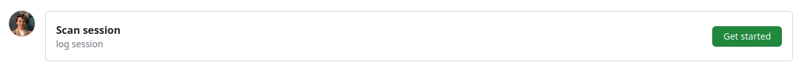
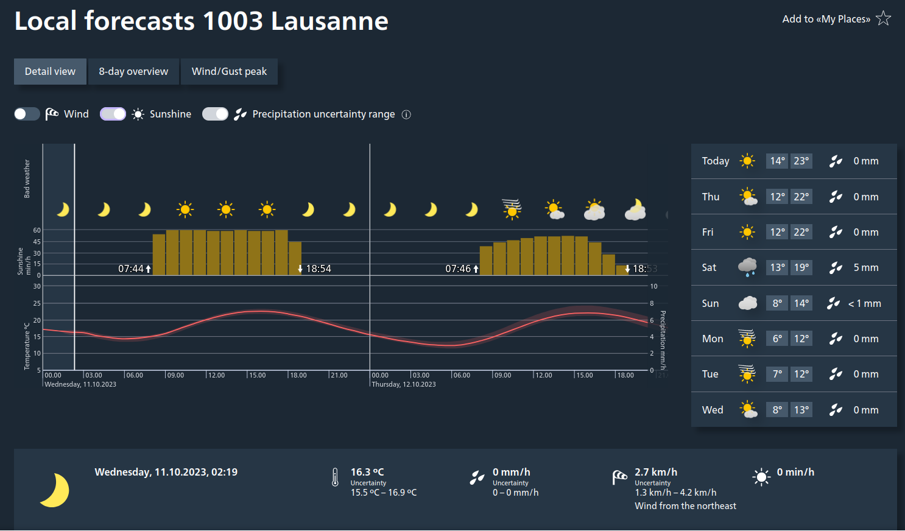

The following section describes how to prepare the session on the day of scan, BEFORE the participant arrives.

## Setting up experiment instruments in the Control Room

!!! important "Switching the GA on early is critical to allow time for its warm-up period (~25 min)"

- [ ] Arrive to the Control Room at least 30 min ahead the session start time.
- [ ] If necessary, [boot the scanner up](notes-scanning.md#scanner-boot-up-protocol)
- [ ] Unroll the bundle of cables that will cross the corridor (one RJ-45/Ethernet-ended for the ET, one mini-USB B -ended, and one standard Swiss power plug, i.e., type J) and stick it to the floor.
- [ ] Connect the standard type J plug of the bundle to a suitable power outlet.
    This plug comes from the multiple-socket power cord extension feeding the physiological recording hardware.

### Setting up the GA

- [ ] Check the color of the {{ settings.gas.tube }} drying tube and the {{ settings.gas.chamber }} desiccant chamber.

    !!! warning "The {{ settings.gas.tube }} drying tube and the {{ settings.gas.chamber }} desiccant chamber MUST be replaced when their inside color turns into pink."

- [ ] Remove the cap from the exhaust outlet and check it is free of obstruction.

    !!! danger "An obstructed exhaust can damage the device!"

- [ ] Check that the pump switch is **OFF** (upward), set it off if needed.
- [ ] Check that the cap on the *Sample In* inlet is removed and that the {{ settings.gas.valve }} valve is connected to it.

    !!! danger "The pump switch MUST BE OFF when the cap is on and when switching the GA on"

- [ ] Turn the device ON (back panel switch).
- [ ] Set the flow control knob at the front of the GA to the maximum.

### Setting up the BIOPAC system and physiological recording sensors

- [ ] Disable the Wi-Fi connection on the *physiology recording computer* (*{{ secrets.hosts.acqknowledge | default("███") }}*).
- [ ] Plug the *AcqKnowledge* software USB license key to the multiport adaptor.
- [ ] Plug the open end of the data link from the BIOPAC (RJ-45 to RJ-45, Ethernet) to the RJ-45 socket of the multiport adaptor.
- [ ] Plug the multiport adaptor to the *physiology recording computer* (*{{ secrets.hosts.acqknowledge | default("███") }}*) as shown in the picture below.

    

!!! danger "The data link and the license key need to stay plugged at all times during the acquisition"

- [ ] Turn BIOPAC's {{ settings.biopac.model }} on with the switch on its back panel.
- [ ] Open the *AcqKnowledge* software
- [ ] Select *Create new graph from recently used file* ⤷ select `EXP_BASE.gtl` and click *Open*.
- [ ] Initiate an *Amphetamin* session to prevent the computer from going to sleep or locking the screen:
    - [ ] Click on the pill icon on the Mac's status bar
    - [ ] Select *New session* ⤷ *While is running* ⤷ *Acqknowledge*.

### Setting up the stimuli presentation and synchronization laptop

- [ ] Place the laptop (*{{ secrets.hosts.acqknowledge | default("███") }}*) on the designated desk.
- [ ] Connect the *{{ secrets.hosts.psychopy | default("███") }}* laptop to the screen switch box (see picture below) with the corresponding HDMI cable. This should project your screen on the screen of CHUV's tower {{ secrets.hosts.acqknowledge | default("███") }}.
    

- [ ] Connect the RJ-45/Ethernet cable from the ET computer into the RJ-45 socket of the *stimuli laptop* ({{ secrets.hosts.psychopy | default("███") }}).
- [ ] Plug the power adaptor to the laptop, and the adaptor to the power outlet on the wall.
- [ ] Switch the laptop on.

    ??? danger "The stimuli laptop (*{{ secrets.hosts.acqknowledge | default("███") }}*) MUST be turned on AFTER the HDMI cable is connected"

        Otherwise, the monitors will not correctly be identified by *Ubuntu* and *Psychopy* will likely fail to present the stimuli in the projector's screen.

    !!! warning "If the monitor does not automatically switch the source of the screen, you can use the button below to switch it."

        

- [ ] Log-in with the username *{{ secrets.login.username_psychopy| default("███") }}* and password `{{ secrets.login.password_psychopy| default("*****") }}`.
- [ ] Switch the SyncBox on.
- [ ] Connect the SyncBox to the laptop with the USB cable.
    It is normally plugged into CHUV's stimuli workstation, it must be re-plugged in there after the session.

    |  |  |
    |:---:|:---:|

- [ ] Connect the {{ settings.biopac.pinkbox_long }} (which is the USB-A cable of the bundle you initially set across the corridor) to one of the USB ports of the laptop *{{ secrets.hosts.psychopy | default("███") }}*.

    !!! danger "The {{ settings.biopac.pinkbox }} MUST be connected to the laptop AFTER the trigger USB cable coming from the SyncBox. "

**Your laptop connections should now look like this:**


- [ ] Configure the display settings of the stimuli presentation laptop *{{ secrets.hosts.psychopy | default("███") }}* in extended mode, **with the secondary screen at a resolution of 800×600**.
- [ ] Check that the service to synchronize the triggers is up with `sudo systemctl status forward-trigger`.

    !!! warning "If the service is down, manually force its start"

        - [ ] Run `sudo systemctl start forward-trigger`
        - [ ] Recheck the status with `sudo systemctl status forward-trigger`.

    !!! important "These commands are executed with `sudo`"

        The console will prompt you for the common user password: `{{ secrets.login.password_psychopy | default("*****") }}`

- [ ] Open a terminal (<span class='keypress'>:fontawesome-brands-windows:</span> + <span class='keypress'>t</span>) and open the service's log in *follow* mode:
    ``` shell
    less +F /var/log/forward-trigger.log
    ```

### Check synchronization

- [ ] Hit the *Start* button of *AcqKnowledge*.
- [ ] Enter the <span class="syncbox">Synchronization</span> mode by selecting it and pushing the enter button :fontawesome-solid-circle:{ .bluecolor }.
- [ ] Hit the down arrow button :fontawesome-solid-caret-down:{ .bluecolor } until you find <span class="syncbox">Send triggerpulse</span>
- [ ] Push the enter button :fontawesome-solid-circle:{ .bluecolor } every time you want to send an <span class="keypress">s</span> character.
- [ ] Check that the *{{ secrets.hosts.psychopy | default("███") }}* laptop types those triggers (e.g., on an open editor receiving keypresses, or the shell prompt, or looking at your open log).
- [ ] Check that the *AcqKnowledge* session running on *{{ secrets.hosts.acqknowledge }}* is properly registering the trigger too in the corresponding digital channel.

### Finalize setting up
- [ ] Stop the *AcqKnowledge* recording and ready a new session.
- [ ] Start a new SyncBox *Synchronization* session:
    - [ ] Push the up arrow button :fontawesome-solid-caret-up:{ .bluecolor } until you find <span class="syncbox">Start Session</span>
    - [ ] Push the enter button :fontawesome-solid-circle:{ .bluecolor } and the syncbox will be now waiting for the scanner's trigger signal to forward it.

    |  |  |
    |:--:|:--:|
    |  {: colspan=2} |

---

## Transitional steps before entering the Scanning Room

### Setting up the projector

!!! important "If someone is already scanning, ask first if you can switch the projector on already"

- [ ] Go to room {{ secrets.rooms.projector | default("███") }}, where the projector is installed.
- [ ] Switch the projector **ON** by hitting the power button, located on its right side.
- [ ] Verify the aim of the projector's beam by looking through the tube into the Scanning Room.

    ??? warning "The projector's position SHALL NOT be modified unless it is evidently off"

        Only in the case that the projector beam is not correctly targeting the projection screen inside the Scanning Room, which is possible if someone accidentally altered the configuration, you may adjust its position as follows:

        - [ ] Adjust the projector tilt to center the projection if it does not properly aim the panel inside the scanner's bore.
            E.g., change the height of the paper pile that supports it (see images, FENS papers).

        |  |  |  |
        |:--:|:--:|:--:|
        | *The tube is the part through which you should check the quality of the projection* {: colspan=3} | | |

- [ ] Verify the projection corresponds to the *Psychopy* laptop ({{ secrets.hosts.psychopy | default("███") }}) screen.
- [ ] Before you exit room {{ secrets.rooms.projector | default("███") }}, grab the *plexiglass* panel where the ET arm will be placed inside the scanner.
- [ ] Take the panel to the Control Room.

### Prepare the ET arm

- [ ] Go to room {{ secrets.rooms.et_camera | default("███") }} and bring the blue box labeled *Eye-Tracker only for fMRI* into the scanning room.
    This box contains the ET arm with the camera and infrared lamp mounted on it, lenses, and the special infrared mirror.
    The box should be found in the first cabinet on the left section of the cupboard.
- [ ] Take the MR-compatible lens out its safe pouch inside the ET box.

    |  |  |
    |:--:|:--:|
    | *The appropriate lens is found in a correspondingly labeled bag (left) and it is the only one with two gold screws (right).* {: colspan=2} |

- [ ] Install the MR-compatible lens, after removing any other present lens.
    If other lens is present, put it back into its plastic bag inside the lenses box after unscrewing and removal.

    !!! danger "The lens MUST be handled with care"

        { align="right" }

        1. The lens MUST be installed in the Control Room, BEFORE taking the ET arm inside the Scanner Room.
        1. One of your hands MUST be under the lens at all times while screwing/unscrewing it, to avoid accidentally dropping a lens.
        1. Screws holding the lens MUST be properly tightened at this point because the vibration of the scanner may loosen them and the screw(s) may drop during the session.

- [ ] Place the ET arm in a safe place in the Control Room until the *plexiglass* panel is ready.

---

## Preparing the Scanning Room

!!! important "Check with the previous user whether you can come in the Scanning Room"

### Setting up the ET

- [ ] Bring the *plexiglass* panel inside the scanning room and place it at the end of the scanner's bore.
    A sign indicates the top side that MUST face up.
    The plastic feet must face down to avoid the panel to slide.
    To ensure the repeatible positioning of the ET, place the end of the plexiglass such that its edge aligns with the edge of the illuminated MRI rails.
- [ ] Exit the Scanning Room and fetch the ET arm.
- [ ] Enter the Scanning Room and place the ET arm on top of the plexiglass panel with the two posterior feet of the ET arm aligned within the two corner markers made of scotch tape.

    !!! danger "Hold the ET arm FIRMLY, because the magnetic field imposes some resistance."

- [ ] Unroll and connect the cables (two plugs for the black, one plug for the orange).
    
- [ ] Take the half-circle one-direction screen from the table behind the scanner and put it on the back of the scanner, behind the ET system (don't push the plexiglass yet)
    

### Setting up the coils

- [ ] If any head coil from the last exam is still plugged, remove it:
    - [ ] If it is the 64-channel coil, you can just temporarily move it into the scanner's bore.
    - [ ] Otherwise, store it on the shelf where the other coils are and bring the 64-channel one in the proximity of the bed (e.g., inside the scanner's bore).
        Make sure to remove other coil's fitting element.
- [ ] Remove the spine coil by lifting the corresponding latch, then sliding it toward the head of the bed, lift it from the bed, and place it on the floor ensuring it is not obstructing any passage or unstable.
- [ ] Place the two back padding elements filling the spine coil socket.
- [ ] Place the 64-channel head-and-neck coil into its socket at the head end of the bed.

### Setting up the physiological recordings

- [ ] Cover the MRI bed with a clean sheet.
- [ ] Unroll the tubes (RB and respiratory gases) and cables (ECG), which will be stored in the access cupboard.
- [ ] Check that the composite tube to collect respiratory gases through the cannula does not have any bubbles.
- [ ] Extend them (respiration probing tubes and ECG cable) through the floor in an "L-shaped" trajectory to the scanner's bore.
    Use sticky tape to fix them to the floor.

    !!! warning "Minimize loosely hanging sections of the tube for the collection of respiratory gases."

        When the tubing is hanging, pressure waves may alter the recorded gas concentration.

- [ ] Connect the distal end of the extension tube to the cannula with a joint connector.
- [ ] Leave the cannula on the bed ready for the participant.
- [ ] Prepare the RB (stored in the cupboard) and leave it on the bed.

### Attach the dedicated infrared mirror to the coil

- [ ] Exit the Scanning Room.
- [ ] Fit in a pair of new latex gloves.
- [ ] Extract the dedicated infrared mirror from the ET box, **CAREFULLY**.
- [ ] Remove the mirror protection **EXTRA-CAREFULLY**.
- [ ] Take the mirror, enter the Scanning Room, and lock the mirror onto the frame of the head-coil.

!!! tip "If interested in the legacy protocol, check [this section](legacy-et.md)"

### Final checks inside the scanning room

- [ ] Prepare padding: under-knee padding, neck-and-head padding, under-elbows padding, head-sides padding, top-head wedge padding.
    - [ ] Wrap a sanitary cover around each padding.
    - [ ] Place a double neck-and-head padding inside the coil, to ensure the eyes are close to the coil's windows:

        |  |  |
        |:---|:---|
        | Padding should be chosen and adjusted to each participant depending on their head size so that their nose is only 1-2mm away from the anterior part of the coil. The anterior part of the head coil will be tight around the participant's nose, so ensure they are nonetheless comfortable. {: colspan=2 } |

- [ ] Prepare a blanket to cover the participant.
- [ ] Prepare a new pair of earplugs.
- [ ] Connect the ECG leads to the hub and leave it prepared on the bed.
- [ ] Check the RB, ECG, and nasal cannula are prepared.
- [ ] Completely disable the light inside of the scanner and the ventilation of the scanning room using [the scanner's interface](notes-scanning.md#scanners-settings-buttons).

    !!! danger "Disable the light and ventilation to facilitate the best performance of the ET"

---

### Finalize ET setup

- [ ] Switch on the ET's PC using the power-on button at its front.
- [ ] Select "Eyelink" when given the option of which operating system to launch.
- [ ] Verify the IP address assigned to the Ethernet interface of the *{{ secrets.hosts.psychopy | default("███") }}* laptop is correct.
    - [ ] Check the output of the following command and verify that IP/mask is **100.1.1.2/24**, and the protocol is IP version 4.
        ``` shell
        ifconfig -a
        ```
    - [ ] Check whether the link is properly established.
        The ET should respond to echos sent from a terminal with:
        ``` shell
        ping 100.1.1.1
        ```

---

## Documentation and secondary instruments

- [ ] Prepare [the informed consent form](../assets/files/icf_FR.pdf) (**first session only**)
- [ ] Prepare an MRI safety screener ([EN](../assets/files/safety_form_EN.pdf)|[FR](../assets/files/safety_form_FR.pdf))
- [ ] Prepare a pen and a receipt form that the participant will sign when they are given the compensation
- [ ] Check you have the AcqKnowledge software USB license key
- [ ] Prepare a pregnancy test (**Only female participants on their first session**)
- [ ] Prepare a thermometer
- [ ] Prepare a blood pressure meter
- [ ] Prepare scrubs and MR-compatible glasses if applicable
- [ ] Prepare a pack of sterile cotton gauze, a bottle of medical alcohol, the *Nuprep* skin preparation gel (white/blue tubes), and three new electrodes.

### Start a new session log form
Collect comments and annotations about the session using GitHub issues.
A laptop should be available to fill the issue.

- [ ] [Click this link](https://github.com/TheAxonLab/hcph-sops/issues/new?assignees=acionca&labels=scan&projects=&template=scan-session.yml&title=%5BSCAN%5D+sub-001_ses-yyy), or alternatively
- [ ] manually open a GitHub Issue at the [SOPs repository](https://github.com/TheAxonLab/hcph-sops):
    - [ ] Under the section `Issues`, click on <span class="consolebutton green">New issue</span>
    - [ ] This should lead you to a page that looks like this
        
        - [ ] Click on <span class="consolebutton green">Get started</span> on the issue template `Scan session`.
- [ ] Modify the title of the issue by replacing `yyy` with the session index.
    If you don't remember the session index of today, check the [session index table](participant-prep.md#session-schedule).
- [ ] Verify that your phone is on ringing mode so the participants can reach you.
- [ ] Check the time regularly to be on time to meet with the participant at the predefined location

### Start a new session log for the collection of covariates

- [ ] [Click this link](https://github.com/{{ secrets.data.covariates_repo | default('<gh_user>/<name>') }}/issues/new?assignees=acionca&labels=mood&projects=&template=mood-questionnaire.yml&title=%5BMOOD%5D+sub-001_ses-yyy), or alternatively
- [ ] manually open a GitHub Issue at the [questionnaire repository](https://github.com/{{ secrets.data.covariates_repo | default('<gh_user>/<name>') }}):
    - [ ] Under the section `Issues`, click on <span class="consolebutton green">New issue</span>

- [ ] Fill the date of the scan as well as the PE for this session (accessible in the [schedule](scanning.md/#before-initiating-the-session))
- [ ] Fill in weather details of the scanning day based [MeteoSwiss](https://www.meteoswiss.admin.ch/local-forecasts/lausanne/1003.html#forecast-tab=detail-view) in 1003 Lausanne.
    - [ ] Report the maximum and minimum temperature in degrees celsius.
    - [ ] Report the wind speed at the time of scanning in km/h.
    - [ ] Report the precipitation type and amount (in mm).
    - [ ] Report the outside atmospheric pressure (in hPa) and relative humidity (in %).
    - [ ] Report the hours of daylight (rounded to the number of hours).

    ??? info "How to find the precipitation information on MeteoSwiss"
        Here is what the MeteoSwiss interface looks like on a computer.
            

        In the screenshot above, the information to be reported would be:

        * Minimum outside temperature for the day of the scan (°C): 14°C
        * Maximum outside temperature for the day of the scan (°C): 23°C
        * Wind speed (km/h): 2.7 km/h
        * Precipitation (mm): 0mm
        * Hours of daylight (h): 11h (18:54-07:44=11:10h roundup)

        Scrolling down, you will find additional measurement values that look like:
            

        Here the relevant additional information is:

        * Current outside atmospheric pressure (hPa): 963 hPa
        * Current outside relative humidity (%): 75.8%

- [ ] Fill in the details related to the MR and scanner room.
    - [ ] Report the MR room temperature (°C) and relative humidity (%)

    ??? info "Location of the MR room thermometer"
        The thermometer in the MR room can be found on the left of the operator window when inside the scanner room (see below).

        

    - [ ] Report MR helium level (%)
        - [ ] In the top bar of the MR console, click on `System`>`Control`.
        - [ ] In the window that just opened, click on the section `MR Scanner`.
        - [ ] Report Helium Fill Level in percentage.
