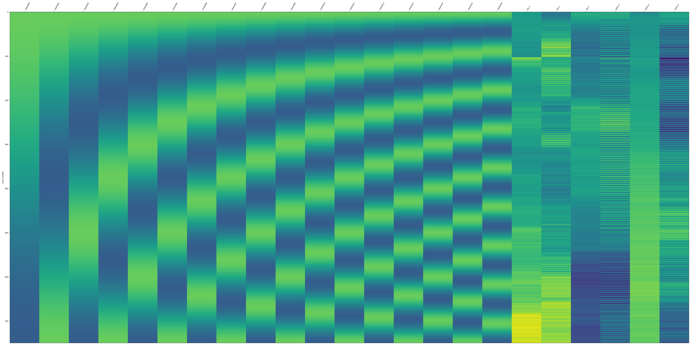
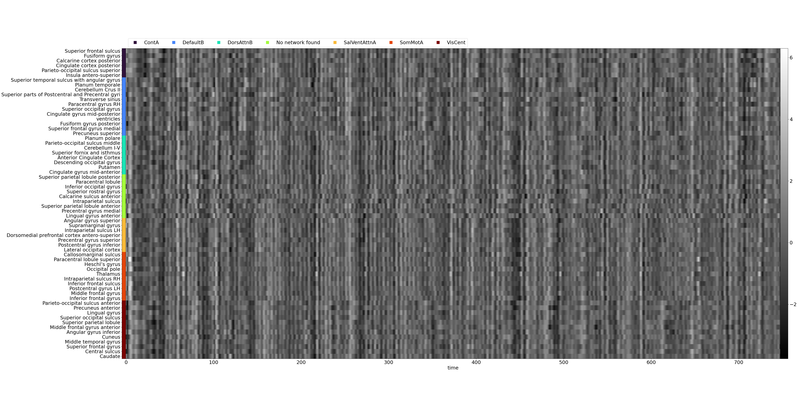
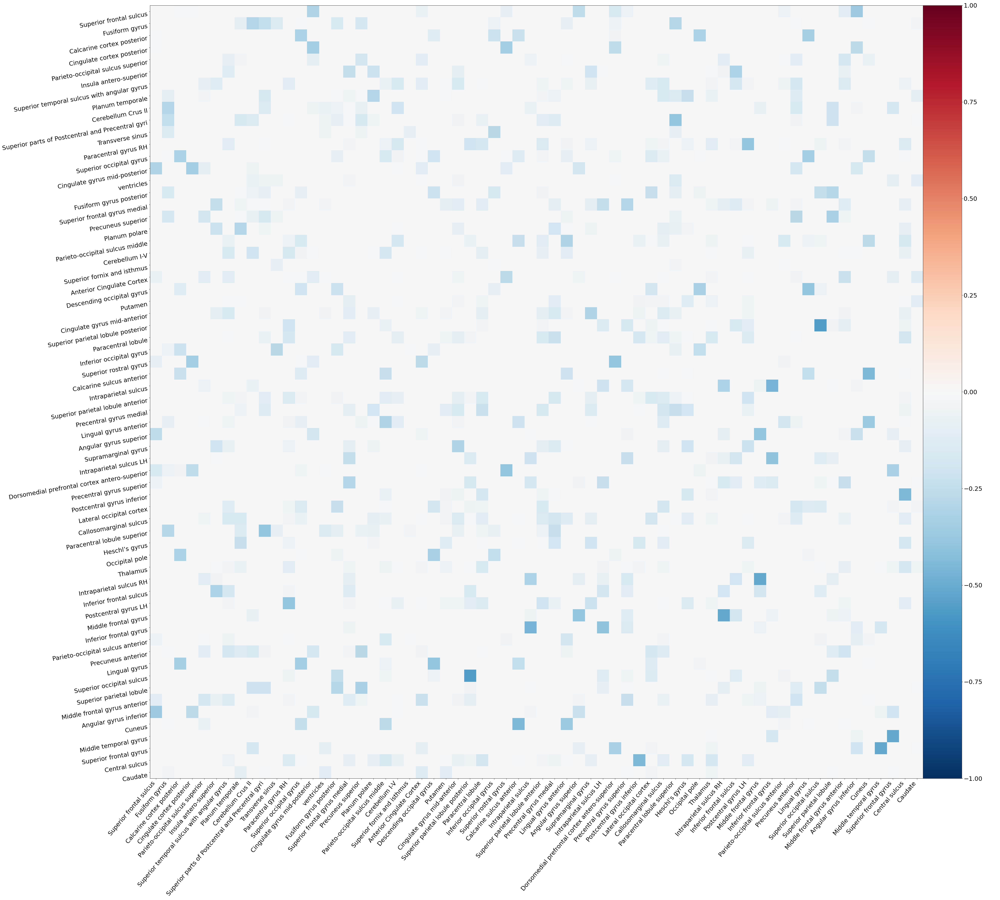

## Computing functional connectivity
First, make sure that the preprocessed fMRI data are available as `derivatives` in your dataset.
An example of data structure should be as follows:
```
├── derivatives
│   ├── fmriprep-23.1.4
│   │   ├── dataset_description.json
│   │   └── sub-pilot
│   │       ├── anat
│   │       ├── figures
│   │       └── ses-15
```

Then, the functional connectvity matrices can be computed using the `compute_fc.py` script.
The easiest, default call of the script only needs a derivative dataset (usually from *fMRIPrep*).
Following the above data structure, it call would be:
``` bash
python compute_fc.py path_to_dataset/derivatives/fmriprep-23.1.4
```

???+ info "Default call of the `compute_fc.py` script"
    When using the default options, the pipeline will (in this order and for all functional tasks):
    
    - [ ] Fetch the [DiFuMo](https://doi.org/10.1016/j.neuroimage.2020.117126) atlas (64 dimensions)
    - [ ] Extract the region-wise averaged timeseries
    - [ ] Interpolate high motion volumes (framewise displacement higher than 0.4 mm) with cubic spline interpolation
    - [ ] Apply a Low-pass butterworth filter (cutoff frequency of 0.15 Hz)
    - [ ] Censor high motion volumes
    - [ ] Remove confounds: motions (6 parameters) and discrete cosine transform basis (high-pass filtering)
    - [ ] Standardize the timeseries
    - [ ] Compute the functional connectivity matrices as the sparse inverse covariance (see this [example](https://nilearn.github.io/stable/auto_examples/03_connectivity/plot_inverse_covariance_connectome.html), using [Graphical Lasso CV](https://scikit-learn.org/stable/modules/generated/sklearn.covariance.GraphicalLassoCV.html#sklearn.covariance.GraphicalLassoCV) of *scikit-learn*)

    Most parameters of the pipeline can be specified in the options (see `python compute_fc.py -h` for more details).

Finally, the pipeline will save the denoised timeseries and connectivity matrices as well as various visual reports (i.e., figures).

??? info "Example of visual report"
    
    - [ ] Denoising confounds as a *design matrix*:
    
    - [ ] Denoised timeseries as a *carpet plot*:
    
    - [ ] Denoised timeseries as a *signal plot*:
    
    - [ ] Functional connetivity matrix as a *heatmap*:
    

The outputs will be stored in a `functional-connectivity` folder in the same parent directory as the preprocessed derivatives dataset.
In the end, the data structure will look like this:
```
├── derivatives
│   ├── fmriprep-23.1.4
│   │   └── sub-pilot
│   │       ├── anat
│   │       ├── figures
│   │       └── ses-15
│   │           ├── anat
│   │           └── func
│   └── functional_connectivity
│       └── DiFuMo64-LP
│           └── sub-pilot
│               ├── figures
│               └── ses-15
│                   └── func
```